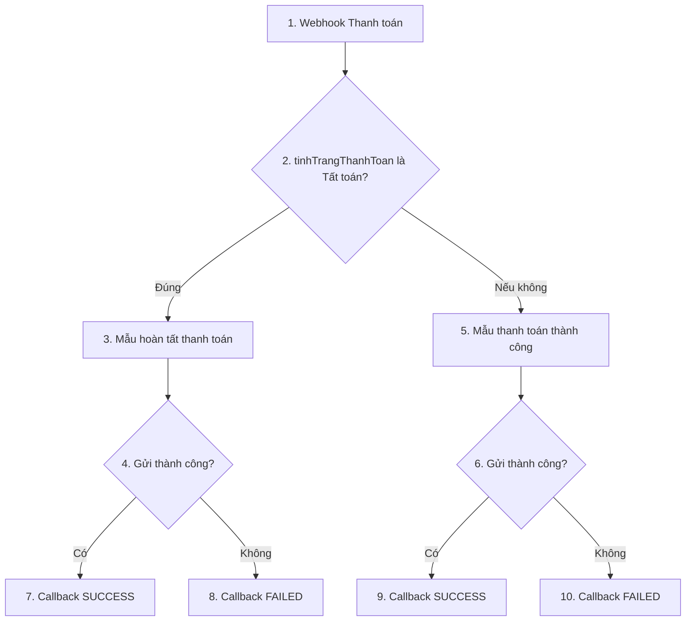

# SAIGON MACHINE — Đặc tả tích hợp ZNS cho Antigravity Code

**Phiên bản tài liệu:** 2.0 · **Ngày:** 05/10/2026 · **Người cung cấp nghiệp vụ:** Ngô Vương Thông

**Phạm vi:** Khách hàng → Báo giá → Hợp đồng → Thanh toán → Giao hàng. Có 5 workflow CNV và 6 mẫu tin do Thanh toán tách thành 2 nhánh. Bảo hành chỉ nằm trong hướng mở rộng, chưa có schema hoặc workflow nguồn để triển khai.

**Mục tiêu bàn giao:** giúp Antigravity đọc code ứng dụng hiện có, hoàn thiện việc tạo payload, gọi đúng workflow, nhận callback, chống gửi trùng và hiển thị lịch sử. Tài liệu độc lập này tập hợp toàn bộ thông tin đã được cung cấp; không cần dùng bản Excel chỉ mô tả Khách hàng làm đặc tả cho các phân hệ còn lại.

| Phần | Nội dung |
| --- | --- |
| 1–3 | Chỉ dẫn cho Antigravity, kiến trúc và cấu hình hiện tại |
| 4–8 | Chi tiết 5 workflow và mapping của 6 mẫu tin |
| 9–11 | Chuẩn bị dữ liệu, callback, mô hình lưu và chống trùng |
| 12–13 | Giao diện, lộ trình triển khai, nghiệm thu và điểm cần xác nhận |
| 14 | Toàn bộ 5 JSON Schema gốc |
| 15 | 6 payload mẫu dùng làm fixture ngoại tuyến |
| 16–17 | Từ điển đầy đủ các trường và danh mục bằng chứng nguồn |

## 1. Chỉ dẫn thực hiện cho Antigravity

### 1.1. Công việc cần làm

1. Đọc cấu trúc dự án, hướng dẫn trong repo, model/collection hiện tại, chức năng gửi ZNS đang có và handler `/api/zns/vendor-webhook/zns-result` trước khi sửa.
2. Tìm điểm gọi webhook ở 5 phân hệ; xác định trigger nghiệp vụ thật, giá trị thật của `action`, `message_type`, `meta.template_key`, quy tắc format/fallback và cách ghi trạng thái vào dữ liệu nguồn.
3. Dùng một service gửi và một handler callback chung, nhưng giữ adapter/schema/mapping riêng theo từng phân hệ và từng nhánh Thanh toán. Không ép tất cả payload về một hình dạng duy nhất.
4. Hoàn thiện outbox/hàng đợi tương đương, lưu yêu cầu trước khi gọi CNV, chống thao tác đồng thời, xử lý callback lặp/trễ/xung đột và đối soát các lần chưa có kết quả.
5. Bổ sung xem trước tin, lịch sử gửi và lỗi cụ thể cho người thao tác. Giữ nội dung mẫu đã được duyệt ở CNV; giao diện ứng dụng không tự tạo thêm tham số ngoài mẫu.
6. Chạy kiểm thử ngoại tuyến, kiểm thử callback bằng mock; sau đó chạy UAT có kiểm soát trên môi trường và số nhận được phép. Báo lại file đã sửa, kết quả kiểm thử, cấu hình còn thiếu và cách bật/tắt từng luồng.

Tên bảng, tên service, event code và cấu trúc file đề xuất trong tài liệu là thiết kế tham khảo. Tận dụng stack, DB, hệ thống quyền và hàng đợi của repo; không di chuyển Firestore sang DB khác hoặc viết lại ứng dụng chỉ để áp dụng tên mẫu.

### 1.2. Quy tắc phân biệt bằng chứng và thiết kế

| Nhãn | Ý nghĩa | Cách sử dụng |
| --- | --- | --- |
| **NGUỒN** | Schema người dùng gửi hoặc cấu hình đọc được trong ảnh | Giữ nguyên tên khóa, chữ hoa/thường, kiểu dữ liệu và logic rẽ nhánh |
| **ĐỐI CHIẾU †** | Tên token trong ảnh bị rút gọn; đường dẫn đầy đủ được khôi phục theo tham số và schema | Có thể dùng dựng adapter/fixture; kiểm tra token đầy đủ trong CNV hoặc code trước khi bật gửi thật |
| **ĐỀ XUẤT APP** | Thiết kế bổ sung cho tính ổn định và khả năng vận hành | Áp dụng phù hợp code hiện có; không trình bày là hành vi đã có của CNV |
| **CẦN XÁC NHẬN** | Nguồn không đủ để kết luận | Ghi rõ vấn đề; tìm trong repo/cấu hình hiện hành, không tự tạo dữ liệu nghiệp vụ để lấp chỗ trống |

Ký hiệu † áp dụng cho **nguồn token đầy đủ**, không phủ nhận tên tham số đích đã đọc được. Các giới hạn độ dài, định dạng số nhận, cơ chế retry và cam kết chống trùng của CNV chưa được cung cấp; tài liệu không tự đặt thành quy định của Zalo/CNV.

### 1.3. Ranh giới triển khai

- Tích hợp hiện tại là **ứng dụng → webhook CNV → action Zalo OA → callback ứng dụng**. Không chuyển sang gọi trực tiếp API Zalo nếu chưa có yêu cầu đổi kiến trúc.
- Trong màn hình CNV, hành động mang tên **Gửi ZBS Template**; tên workflow và nghiệp vụ vẫn dùng ZNS. Đây là cách gọi trong nguồn, không phải hai kênh cần gửi song song.
- Sự xuất hiện của các phân hệ theo thứ tự nghiệp vụ không chứng minh callback thành công của luồng trước là điều kiện bắt buộc của luồng sau. Mỗi thông báo phải gắn với sự kiện nghiệp vụ của chính nó.
- Tài liệu là đặc tả triển khai; chưa có thay đổi ứng dụng, cấu hình CNV, gửi tin thật hay kết quả UAT nào được thực hiện trong quá trình lập tài liệu.

## 2. Tổng quan và phân công trách nhiệm

### 2.1. Danh mục workflow

| Mã tài liệu | Workflow CNV | Điều kiện nhìn thấy trước gửi | Mẫu tin | ID đọc từ ảnh |
| --- | --- | --- | --- | --- |
| KH | `LAST_ZNS_KHÁCH HÀNG` | `newValues.hanh_dong_gui_zns_pre_quote == "Gửi tin"` | THÔNG TIN GIẢI PHÁP MÁY CÔNG NGHIỆP | `533060` |
| BG | `LAST_ZNS_BÁO GIÁ` | Không thấy node lọc trước gửi | THÔNG BÁO BÁO GIÁ THÀNH CÔNG | `533064` |
| HD | `LAST_ZNS_HỢP ĐỒNG` | Không thấy node lọc trước gửi | XÁC NHẬN KÝ HỢP ĐỒNG THÀNH CÔNG | `533068` |
| TT-TATTOAN | `LAST_ZNS_THANH TOÁN` | `newValues.tinhTrangThanhToan == "Tất toán"` | Copy of XÁC NHẬN HOÀN TẤT THANH TOÁN Ver2 | `552490` |
| TT-THU | Cùng workflow Thanh toán | Nhánh “Nếu không thì” của phép so sánh trên | XÁC NHẬN THANH TOÁN THÀNH CÔNG ver2 | `547381` |
| GH | `LAST_ZNS_GIAO HÀNG` | Không thấy node lọc trước gửi | XÁC NHẬN GIAO HÀNG (Chính thức) | `552545` |

Các ID là bản chép từ ảnh, cần đối chiếu cấu hình quản trị khi triển khai. Mọi mẫu trong ảnh có nhãn “Đã duyệt”; đây là trạng thái tại lúc chụp, không phải xác nhận tình trạng hiện tại. OA chung: **Cơ Khí Công Nghiệp Sài Gòn**. Cả 6 bước gửi đều chọn **Gửi qua SĐT**, số nhận lấy từ **`phone` ở cấp gốc**.

### 2.2. Trách nhiệm từng lớp

| Lớp | Trách nhiệm |
| --- | --- |
| Màn hình nghiệp vụ | Người dùng yêu cầu gửi, xem người nhận và dữ liệu, xem kết quả/lịch sử; không chứa secret |
| Backend ứng dụng | Kiểm tra quyền và trạng thái nghiệp vụ; lấy dữ liệu đáng tin cậy; format payload; tạo request; lưu bền vững; gọi CNV |
| CNV | Nhận đúng schema từng workflow, chọn nhánh theo cấu hình, mapping tham số và gọi action Zalo OA |
| Callback backend | Xác thực, đối chiếu `request_id`, lưu sự kiện và cập nhật đúng attempt; không sửa nghiệp vụ thanh toán/giao hàng chỉ từ kết quả gửi tin |
| Vận hành | Cấu hình workflow, mẫu và secret theo môi trường; đối soát timeout, callback lỗi và xung đột |

`template_data` là dữ liệu hiển thị đã chuẩn bị ở Web đối với Báo giá; schema Hợp đồng cũng mô tả đã fallback/làm sạch. Tuy nhiên, **CNV vẫn đang ghép chuỗi tại Hợp đồng và Tất toán**, Khách hàng dùng trực tiếp `newValues`, còn đơn vị tính Giao hàng lấy `entity_data.dvt`. Không viết một hàm gửi cho rằng mọi mẫu đều truyền nguyên `template_data`.

## 3. Endpoint và cấu hình kết nối

### 3.1. Webhook ứng dụng gọi CNV — NGUỒN

Tất cả dùng `POST`. Body là JSON theo schema riêng ở Phụ lục A. Các URL dưới đây chép từ cấu hình ảnh; lấy bản xác nhận từ quản trị CNV khi thiết lập biến môi trường. Không dùng các URL này làm endpoint thử tự động của bộ test.

| Phân hệ | Biến cấu hình server đề xuất | URL trong ảnh |
| --- | --- | --- |
| Khách hàng | `CNV_ZNS_CUSTOMER_WEBHOOK_URL` | `https://hub.cnvcdp.com/webhook/e2c1c68e-8075-424b-9bf0-c9061c51ce18-7409-678568754e04-a6dee0cb4` |
| Báo giá | `CNV_ZNS_QUOTATION_WEBHOOK_URL` | `https://hub.cnvcdp.com/webhook/5bf3fd76-9e8f-4008-b825-c4639fd43116-73ff-88325a7b35ed-e30f03fad` |
| Hợp đồng | `CNV_ZNS_CONTRACT_WEBHOOK_URL` | `https://hub.cnvcdp.com/webhook/70742289-f67f-4892-a3b9-b4eb28167d35-7bb9-b0be94c9a782-218e51587` |
| Thanh toán — cả 2 nhánh | `CNV_ZNS_PAYMENT_WEBHOOK_URL` | `https://hub.cnvcdp.com/webhook/d7e6345c-d732-4104-92d8-0e1930a12b6f-7cb1-6118d544b450-fc775af3d` |
| Giao hàng | `CNV_ZNS_DELIVERY_WEBHOOK_URL` | `https://hub.cnvcdp.com/webhook/f795ffef-5d21-425d-8af9-b2361116961f-7362-d99b4e61a2a4-c5074e61b` |

Header/auth chiều **App → CNV** chưa được thấy trong ảnh. `Content-Type: application/json` là cách gửi JSON đề xuất ở app. Không tự dùng khóa callback làm khóa xác thực chiều này.

### 3.2. Callback CNV gọi ứng dụng — NGUỒN

```text
POST https://sgm-os.onrender.com/api/zns/vendor-webhook/zns-result
Content-Type: application/json
x-api-key: <ZNS_CALLBACK_API_KEY>
```

Mọi nhánh callback đang dùng cùng URL. Giá trị secret thực trong ảnh được thay bằng tên biến; cung cấp qua cấu hình server/CNV, không ghi vào code hoặc frontend. Vì khóa đã xuất hiện trong ảnh bàn giao, cần thay bằng secret riêng theo môi trường khi cấu hình vận hành.

Callback thành công:

```json
{
  "request_id": "REQ-EXAMPLE-001",
  "status": "SUCCESS"
}
```

Callback thất bại:

```json
{
  "request_id": "REQ-EXAMPLE-001",
  "status": "FAILED"
}
```

`request_id` luôn được lấy từ **Webhook bước 1**. `status` là chuỗi cố định theo nhánh. Ảnh chưa cho thấy `message_id`, `error_code`, `error_message`, thời gian phía nhà cung cấp, trạng thái đã giao hoặc đã đọc. Thiết lập HTTP của node callback: đầu ra `Body: Text`, có chọn `Follow redirect`. Response API hiện tại và lịch retry callback của CNV chưa được cung cấp.

### 3.3. Registry cấu hình ở app — ĐỀ XUẤT APP

Lưu cấu hình được version hóa cho mỗi loại thông báo: `module`, `notification_kind`, `workflow_url_ref`, `template_id`, `template_name`, `payload_schema_key`, `mapping_version`, `enabled`, `recipient_policy`, `business_trigger`, `wire_values`, `required_paths`, `timeout_policy` và `retry_policy`.

`wire_values` chứa giá trị thật của `action`, `message_type`, `meta.source`, `meta.template_key` và `meta.template_version` nếu schema có khai báo. Chưa có các literal này trong nguồn; phải tìm từ code/payload đang chạy. Không lấy ID mẫu, tên workflow hoặc mã KH/BG/HD/TT/GH trong tài liệu để tự gán vào `message_type`.

`template_id` và phiên bản mapping có thể chỉ lưu nội bộ vì workflow hiện tại đã chọn sẵn mẫu. Việc gửi `meta.template_key` không chứng minh CNV tự đổi mẫu theo trường này. Giữ riêng **version tài liệu**, **version registry/mapping** và **`meta.template_version` trên wire**.

## 4. Luồng Khách hàng — KH

### 4.1. Các bước hiện tại

| Bước CNV | Xử lý | Kết quả / nhánh |
| --- | --- | --- |
| 1 | Nhận webhook POST theo schema KH | Sang bước 2 |
| 2 | Kiểm tra `newValues.hanh_dong_gui_zns_pre_quote` là `Gửi tin` | Đúng → 3; không đúng → ảnh không cho thấy node tiếp theo |
| 3 | Gửi mẫu `533060` qua root `phone` | Sang 4 |
| 4 | Kiểm tra kết quả bước 3 là Thành công | Đúng → 5; nếu không → 6 |
| 5 | POST callback `SUCCESS` | `request_id` từ bước 1 |
| 6 | POST callback `FAILED` | `request_id` từ bước 1 |

### 4.2. Mapping mẫu

| Đích | Nguồn payload | Ghi chú |
| --- | --- | --- |
| SĐT nhận | `phone` | Root; không lấy tham số nội dung để thay người nhận |
| `<customer_name>` | `newValues.tenKhachHang` † | Root `customer_name` có trong schema nhưng không phải nguồn đang mapping |
| `<phone>` | `newValues.sdt` | SĐT trong nội dung |
| Điều kiện gửi | `newValues.hanh_dong_gui_zns_pre_quote` | Đúng chuỗi `Gửi tin` |

Mẫu giới thiệu giải pháp máy công nghiệp, nút **Zalo Mini App**. Ảnh xem trước dùng câu có “mã khách hàng `<phone>`”, nhưng mapping lại lấy `newValues.sdt`. Giữ nguyên cấu hình khi tương thích; ghi nhận chênh lệch ý nghĩa để chủ nghiệp vụ chọn sửa nội dung mẫu hay đổi mapping. Không tự thay bằng `maKh`. Mini App ID/URL đích chưa được cung cấp.

**ĐỀ XUẤT APP:** kiểm tra cờ trước khi gọi CNV. Nếu cờ không đúng, ghi `SKIPPED` với lý do và không phát request ra ngoài. Nhánh CNV không gửi hiện chưa có callback; app không nên tạo một yêu cầu chờ kết quả vô thời hạn cho nhánh này.

## 5. Luồng Báo giá — BG

### 5.1. Các bước hiện tại

| Bước CNV | Xử lý | Kết quả / nhánh |
| --- | --- | --- |
| 1 | Nhận webhook POST theo schema BG | Sang 2 |
| 2 | Gửi mẫu `533064` qua root `phone` | Sang 3 |
| 3 | Kết quả bước 2 là Thành công | Đúng → 4; nếu không → 5 |
| 4 | Callback `SUCCESS` | `request_id` từ bước 1 |
| 5 | Callback `FAILED` | `request_id` từ bước 1 |

Ảnh không có điều kiện kiểm tra `tinhTrangBaoGia`, `message_type` hoặc `action` trước gửi. Việc chỉ gửi khi tạo/duyệt/phát hành báo giá phải được xác minh trong ứng dụng.

### 5.2. Mapping mẫu

| Đích | Nguồn payload | Ghi chú |
| --- | --- | --- |
| SĐT nhận | `phone` | Root |
| `<customer_name>` | `template_data.customer_name` † | Không lấy trực tiếp tên thô trong CNV |
| `<so_phieu_bao_gia>` | `template_data.so_phieu_bao_gia` † | String |
| `<ngay_bao_gia>` | `template_data.ngay_bao_gia` † | Web đã format |
| `<ngay_het_han>` | `template_data.ngay_het_han` † | Web đã format |
| `<sl_may>` | `template_data.sl_may` | String; khác `newValues.slMay` là number |
| `<nguoi_phu_trach>` | `template_data.nguoi_phu_trach` † | Giá trị hiển thị |

`template_data.noi_dung_ghi_chu` và `template_data.loai` có trong schema, chưa thấy được mapping vào mẫu này. `subTotal` và `totalAmount` cũng không xuất hiện trong tham số mẫu. Mẫu thông báo lập báo giá thành công và có nút **Quan tâm OA**.

Schema BG mô tả `request_id` dùng chống trùng thay STT. Điều này xác nhận mục đích của ID, **chưa chứng minh CNV có cơ chế chống gửi trùng thực thi**. App vẫn phải chống trùng trước khi gọi webhook.

BG không khai báo `customer_name` ở root và không khai báo ID báo giá trong `newValues`. App phải lưu liên kết `entity_id` của báo giá ở bản ghi request nội bộ; không dựa vào callback để tìm theo số điện thoại hoặc số phiếu gần nhất.

## 6. Luồng Hợp đồng — HD

### 6.1. Các bước hiện tại

| Bước CNV | Xử lý | Kết quả / nhánh |
| --- | --- | --- |
| 1 | Nhận webhook POST theo schema HD | Sang 2 |
| 2 | Gửi mẫu `533068` qua root `phone` | Sang 3 |
| 3 | Kết quả bước 2 là Thành công | Đúng → 4; nếu không → 5 |
| 4 | Callback `SUCCESS` | `request_id` từ bước 1 |
| 5 | Callback `FAILED` | `request_id` từ bước 1 |

### 6.2. Mapping mẫu

| Đích | Nguồn payload | Ghi chú |
| --- | --- | --- |
| SĐT nhận | `phone` | Root |
| `<customer_name>` | `template_data.customer_name` † | Không phải root `customer_name` |
| `<phone>` | `template_data.phone` | Có thể có format hiển thị khác root nhưng phải cùng số nhận |
| `<order_code>` | `template_data.order_code` † | Xem trước gọi đây là mã hợp đồng; không tự chọn `soDonHang` chỉ vì tên `order_code` |
| `<ngay_ky>` | `template_data.ngay_ky` † | String đã chuẩn bị |
| `<so_ngay>` | `template_data.so_ngay` † | String đã chuẩn bị |
| `<so_phieu>` | `template_data.so_phieu` † + literal `\| SL:` + `newValues.slMay` + `newValues.dvt` | Ảnh thể hiện ghép nhiều thành phần trong CNV |
| `<nhan_vien>` | `template_data.nhan_vien` † | Nhân viên phụ trách |

Biểu thức đọc dễ hiểu dự kiến cho `<so_phieu>`: **`BG-EXAMPLE-001 | SL: 2 Máy`**. Ký tự `| SL:` và 2 nguồn `newValues.slMay`, `newValues.dvt` nhìn thấy rõ; khoảng trắng/ký tự xuống dòng chính xác và token `template_data.so_...` cần kiểm tra trên CNV. Ví dụ trên không khẳng định dấu cách hiện tại.

**Tránh ghép hai lần:** khi giữ mapping CNV hiện tại, Web chỉ chuẩn bị số phiếu trong `template_data.so_phieu`. Nếu muốn chuyển toàn bộ chuỗi ghép sang Web thì phải sửa mapping CNV và version hóa đồng bộ, không chỉ sửa một phía.

Schema HD dùng đúng khóa **`template_data.So_don_hang`** với `S` hoa; chưa thấy khóa này được mapping vào mẫu. HD có `$schema` draft-04 và **không khai báo `meta`**. Không tự thêm `meta` chỉ để giống các phân hệ khác. Mẫu có nút **Quan tâm OA**.

## 7. Luồng Thanh toán — TT

### 7.1. Rẽ nhánh hiện tại



Điều kiện dùng **`newValues.tinhTrangThanhToan`**, toán tử **Là**, giá trị **`Tất toán`**. Nhánh còn lại của CNV là mọi trường hợp không thỏa điều kiện, không phải một phép kiểm tra đã thu tiền. Chuỗi sai dấu, khác hoa/thường, trạng thái chưa thanh toán hoặc dữ liệu thiếu không được tự coi là một khoản thu hợp lệ ở app. Hành vi so sánh khi trường thiếu của CNV chưa được xác minh; app phải chặn trước.

Hai nhánh cùng một webhook. Một sự kiện Thanh toán chỉ chọn **một** nhánh. Không gọi webhook hai lần để gửi cả thông báo thông thường lẫn thông báo tất toán cho cùng sự kiện.

### 7.2. Mẫu Tất toán — bước 3, ID `552490`

| Đích | Nguồn payload | Ghi chú |
| --- | --- | --- |
| SĐT nhận | `phone` | Root |
| `<customer_name>` | `template_data.customer_name` † | Khác nguồn tên ở nhánh thông thường |
| `<phone>` | `phone` | Root, không phải `template_data.phone` |
| `<so_don_hang>` | `template_data.so_don_hang` † + literal `\| Số lượng SP:` + `template_data.so_luong` † | Hai token `template_data.so_...` bị rút gọn; xác minh chính xác trước bật |
| `<so_hop_dong>` | `template_data.so_hop_dong` † | Chuỗi số hợp đồng |
| `<ngay_thanh_toan>` | `template_data.ngay_thanh_toan` † | Thời điểm thanh toán hiển thị |

Chuỗi ghép dự kiến để đối chiếu: **`DH-EXAMPLE-001 | Số lượng SP: 2`**. CNV đang ghép chuỗi, nên không ghép sẵn cụm “Số lượng SP” vào `template_data.so_don_hang` ở Web. Các dấu cách chính xác cần chốt cùng token đầy đủ.

Mẫu có nội dung xác nhận đã nhận đủ khoản thanh toán, nút **Quan tâm OA**. App phải lấy trạng thái tất toán từ nghiệp vụ/công nợ đã xác nhận; không tạo thông tin tất toán từ callback ZNS.

### 7.3. Mẫu Thanh toán thông thường — bước 5, ID `547381`

| Đích | Nguồn payload | Ghi chú |
| --- | --- | --- |
| SĐT nhận | `phone` | Root |
| `<customer_name>` | `customer_name` | **Root**, không lấy `template_data.customer_name` như nhánh tất toán |
| `<phone>` | `phone` | Root |
| `<order_code>` | `template_data.order_code` † | Xem trước hiển thị là mã đơn hàng |
| `<time>` | `template_data.time` | Thời điểm thanh toán; không tự dùng giờ hệ thống khi gửi |
| `<so_luong>` | `template_data.so_luong` † | Số lượng máy dạng chuỗi |

Mẫu thông báo khoản thanh toán đã được ghi nhận, nút **Quan tâm OA**. Cả hai mẫu Thanh toán **không có tham số số tiền** trong ảnh. `newValues.soTien` và `newValues.totalAmount` vẫn là number trong snapshot; không tự thêm `<amount>` hoặc nội dung tiền vào mẫu đã duyệt.

### 7.4. Quy tắc bổ sung tại app

- Chỉ phát thông báo từ khoản thu/sự kiện nghiệp vụ đã xác nhận và được phép gửi. Danh sách trạng thái ngoài `Tất toán` đủ điều kiện chưa được cung cấp; lấy từ code và nghiệp vụ, không tự tạo enum bằng suy đoán.
- Lưu `paymentId`, `contractId`, `customerId`, loại nhánh và trạng thái nguồn tại lúc tạo request. Callback chỉ cập nhật trạng thái thông báo, không đặt trạng thái khoản thu thành `Tất toán`.
- Nhánh chọn từ snapshot bất biến. Nếu công nợ thay đổi trong lúc chờ gửi, không lặng lẽ đổi payload/nhánh của cùng `request_id`; hủy trước gửi nếu còn chắc chắn chưa phát đi, hoặc xử lý bằng sự kiện nghiệp vụ mới đã được phê duyệt.
- `meta.template_version` là number; schema TT không khai báo `meta.created_at`. Thời điểm tạo request vẫn được lưu nội bộ ở app.

## 8. Luồng Giao hàng — GH

### 8.1. Các bước hiện tại

| Bước CNV | Xử lý | Kết quả / nhánh |
| --- | --- | --- |
| 1 | Nhận webhook POST theo schema GH | Sang 2 |
| 2 | Gửi mẫu `552545` qua root `phone` | Sang 3 |
| 3 | Kết quả bước 2 là Thành công | Đúng → 4; nếu không → 5 |
| 4 | Callback `SUCCESS` | `request_id` từ bước 1 |
| 5 | Callback `FAILED` | `request_id` từ bước 1 |

### 8.2. Mapping mẫu và phân biệt chữ hoa/thường

| Tham số đích trong mẫu | Nguồn payload | Ghi chú |
| --- | --- | --- |
| SĐT nhận | `phone` | Root |
| `<customer_name>` | `template_data.customer_name` † | Tên đã chuẩn bị |
| `<phone>` | `template_data.phone` | Số hiển thị |
| **`<So_hop_dong>`** | `template_data.so_hop_dong` † | Đích `S` hoa; key JSON nguồn `s` thường |
| **`<So_don_hang>`** | `template_data.so_don_hang` † | Đích `S` hoa; key JSON nguồn `s` thường |
| `<so_phieu_xuat>` | `template_data.so_phieu_xuat` † | String |
| `<ngay_giao_may>` | `template_data.ngay_giao_may` † | Ngày giao hiển thị |
| `<danh_sach_ma_may>` | `template_data.danh_sach_ma_may` † | Danh sách serial/mã máy dạng string |
| `<so_luong>` | `template_data.so_luong` † | Số lượng dạng string |
| **`<dvt>`** | **`entity_data.dvt`** | Nguồn nhìn thấy rõ; không lấy `template_data.dvt` dù schema có khóa đó |

Payload dùng **`entity_data`**, không dùng `newValues`. Giữ nguyên khác biệt này trong serializer. Không đổi khóa JSON `so_hop_dong` thành `So_hop_dong`; chữ hoa ở đây thuộc **tên tham số của mẫu**, không phải tên trường trong payload.

Mẫu thông báo kế hoạch giao theo thông tin đã thống nhất, có số phiếu xuất, ngày giao, danh sách serial, tổng số lượng và đơn vị tính; đề nghị khách bố trí nhận/bàn giao. Nút **Quan tâm OA**. Callback `SUCCESS` của tin này không chứng minh máy đã được giao hoặc đã ký nhận.

### 8.3. Dữ liệu phải xử lý ở Web

- Liên kết `entity_data.deliveryId`, `contractId`, `customerId` với lịch sử thông báo; `stt` chỉ là trường tương thích, không dùng thay `request_id`.
- `danh_sach_ma_may` chưa có danh sách serial tương ứng trong schema `entity_data`. Tìm bảng/collection chi tiết máy/phiếu xuất liên quan; chỉ lấy serial thật của đợt giao này. Không tạo serial từ `slMay` hoặc lấy toàn bộ máy của hợp đồng khi chỉ giao một phần.
- Chốt `ngay_giao_may` lấy ngày kế hoạch hay ngày thực tế theo mốc gửi. Không tự fallback sang ngày hiện tại hoặc dùng `ngayGiaoThucTe` rỗng.
- Kiểm tra số lượng và đơn vị của **đợt giao**. Nếu có nhiều đơn vị, phải có quy tắc hiển thị được nghiệp vụ và mẫu chấp nhận; không mặc định một đơn vị chung.
- `soDienThoaiDonViVanChuyen` là số vận chuyển, không phải số nhận ZNS của khách. Không tự fallback người nhận sang trường này.

## 9. Hợp đồng dữ liệu và kiểm tra trước gửi

### 9.1. Khác biệt bắt buộc giữ nguyên

| Đặc điểm | KH | BG | HD | TT | GH |
| --- | --- | --- | --- | --- | --- |
| `customer_name` root được khai báo | Có | Không | Có | Có | Có |
| `template_data` | Không | Có | Có | Có | Có |
| Snapshot | `newValues` | `newValues` | `newValues` | `newValues` | **`entity_data`** |
| `meta` | Có | Có | **Không khai báo** | Có | Có |
| `meta.created_at` | Có | Có | Không khai báo | **Không khai báo** | Có |
| `meta.template_version` | Không khai báo | Không khai báo | Không khai báo | **number** | **number** |
| `$schema` | Không khai báo | Không khai báo | **draft-04** | Không khai báo | Không khai báo |
| `stt` root | Không khai báo | Không khai báo | Không khai báo | Không khai báo | **string** |
| Khóa số đơn trong `template_data` | — | — | **`So_don_hang`** | `so_don_hang` | `so_don_hang` |

“Không khai báo” không đồng nghĩa schema gốc cấm trường ngoài danh sách. Cả 5 schema đều không có `required`, `enum`, `format`, `minLength`, `maxLength` hoặc `additionalProperties: false`. Vì vậy `{}` hoặc chuỗi rỗng có thể qua kiểm tra hình dạng gốc, nhưng không đủ dữ liệu để gửi tin. Khi trường có mặt, phải đúng kiểu khai báo; ví dụ `phone: 123` và `phone: null` không phải string.

Giữ riêng **schema tương thích nguồn** và **validator nghiệp vụ ở app**. Không sửa schema đang chạy ở CNV bằng các ràng buộc mới mà chưa đối chiếu tương thích. Payload được tạo có chọn lọc theo từng adapter, không gửi toàn bộ đối tượng DB không kiểm soát.

### 9.2. Ràng buộc tại ứng dụng — ĐỀ XUẤT APP

| Nhóm | Quy tắc trước khi tạo attempt |
| --- | --- |
| Phân hệ và cấu hình | Có registry đã bật, endpoint theo môi trường, literal wire đã xác minh, schema và mapping đúng mẫu |
| Quyền | Backend xác minh người thao tác có quyền trên hồ sơ/sự kiện; không chỉ disable nút ở frontend |
| Liên kết hồ sơ | Có ID bản ghi và business occurrence ổn định lưu nội bộ, kể cả BG không có ID trong payload |
| Người nhận | Root `phone` không rỗng; áp dụng chính sách số nhận đã xác nhận với CNV; luôn giữ string |
| Tên/điện thoại hiển thị | Có đủ nguồn đang được mapping ở mẫu đã chọn; các bản sao điện thoại phải cùng danh tính sau chuẩn hóa |
| Tham số mẫu | Mỗi tham số thực dùng không rỗng, không chứa chuỗi placeholder, `undefined`, `null`, `NaN` do chuyển kiểu lỗi; kiểm tra giới hạn của mẫu sau khi ghép |
| Trạng thái nghiệp vụ | KH đúng cờ; TT là khoản thu đã xác nhận; BG/HD/GH đúng mốc gửi đã xác minh trong repo/nghiệp vụ |
| Snapshot | Chụp dữ liệu cùng một phiên bản nghiệp vụ; lưu payload, nhánh, người nhận, mapping version trước khi worker chạy |
| Dữ liệu nhạy cảm | Chỉ trả phần cần cho UI; log kỹ thuật che số nhận, không ghi khóa API hoặc toàn bộ snapshot mặc định |

`required_paths` của app gồm root `request_id`, `phone`, các literal cấu hình cần dùng và **tất cả nguồn tham số của mẫu đã chọn**. Bổ sung `newValues.hanh_dong_gui_zns_pre_quote` ở KH, `newValues.tinhTrangThanhToan` ở TT, các thành phần chuỗi ghép HD/Tất toán và `entity_data.dvt` ở GH. Không bắt mọi trường phụ của schema phải có nội dung chỉ vì được khai báo.

### 9.3. Nguồn để Web chuẩn bị `template_data` — phương án cần đối chiếu code

Ảnh chỉ cho thấy CNV lấy giá trị payload; không chứng minh Web đã xây giá trị đó theo cách nào. Bảng dưới là **ĐỀ XUẤT/ĐỐI CHIẾU**, không phải thuật toán fallback đã xác nhận.

| Luồng | Trường hiển thị | Nguồn ứng viên cần đối chiếu |
| --- | --- | --- |
| BG/HD/TT/GH | `template_data.customer_name` | Chính sách tên khách/người đại diện đang dùng; kiểm tra builder hiện có trước chọn `tenKhachHang` hoặc `nguoiDaiDien` |
| HD/TT/GH | `template_data.phone` | Số đã xác nhận của cùng người nhận với root `phone`; format hiển thị theo cấu hình |
| BG | `so_phieu_bao_gia`, `ngay_bao_gia`, `ngay_het_han` | `newValues.soPhieuBaoGia`, `ngayBaoGia`, `ngayHetHan`; chỉ tính ngày hết hạn từ `hieuLuc` nếu đã chốt quy tắc |
| BG | `sl_may`, `nguoi_phu_trach` | Format `newValues.slMay`; giải mã `nguoiPhuTrach` thành tên nếu nguồn đang lưu ID |
| BG | `noi_dung_ghi_chu`, `loai` | `newValues.noiDungGhiChu`, `newValues.loai`; hiện chưa dùng trong mẫu |
| HD | `order_code` | Mẫu gọi là mã hợp đồng: đối chiếu `newValues.soHopDong`; không tự dùng fallback khác chứng từ |
| HD | `So_don_hang` | `newValues.soDonHang`; alias tương thích, chưa thấy dùng trong mẫu |
| HD | `ngay_ky`, `so_ngay`, `so_phieu`, `nhan_vien` | `ngayKy`, `soNgayDuKienHoanThanh`, `soPhieuBaoGia`, `nguoiPhuTrach` |
| TT | `order_code`, `so_don_hang`, `so_hop_dong` | Theo ý nghĩa mẫu: `soDonHang`, `soDonHang`, `soHopDong`; xác minh builder/fallback đang chạy |
| TT | `time`, `ngay_thanh_toan` | Cùng nguồn thời điểm khoản thu `ngayThanhToan`, định dạng theo từng mẫu; không lấy `ngayDenHan` |
| TT | `so_luong` | Format `newValues.slMay`; chốt có ghép `dvt` hay không theo mẫu và builder hiện tại |
| GH | `so_hop_dong`, `so_don_hang`, `so_phieu_xuat` | `entity_data.soHopDong`, `soDonHang`, `soPhieuXuat` |
| GH | `ngay_giao_may` | Ngày kế hoạch/thực tế theo mốc gửi đã chốt; không tự gộp hai khái niệm |
| GH | `danh_sach_ma_may` | Chi tiết serial của đúng đợt giao; nguồn chưa có trong schema snapshot, phải tìm quan hệ dữ liệu |
| GH | `so_luong`, `dvt` | Format `entity_data.slMay`; đồng nhất `template_data.dvt` với nguồn nếu gửi trường này, nhưng mapping CNV vẫn dùng `entity_data.dvt` |

### 9.4. Format, kiểu dữ liệu và fallback

- Mọi tham số con trong `template_data` đều là **string**. Các số tiền, tỷ lệ, số lượng trong snapshot giữ **number** theo schema; không format thành `"100.000.000"` trong `newValues.totalAmount`.
- Nếu DB dùng Firestore Timestamp/Date, serializer phải chuyển sang string đúng hợp đồng; mô tả “snapshot nguyên bản” không cho phép gửi một object Timestamp vào trường đã khai báo string.
- Ngày hiển thị ví dụ `dd/MM/yyyy`, thời điểm ví dụ `dd/MM/yyyy HH:mm`; đây là đề xuất để đối chiếu mẫu. Ngày nguồn có thể giữ dạng đang dùng; phân biệt date-only với timestamp để tránh lệch ngày khi đổi múi giờ. Lưu thời gian kỹ thuật kèm múi giờ rõ ràng.
- Không dùng `String(undefined)`, `String(null)` hoặc đặt số tiền/ngày/số chứng từ giả làm fallback. Trường bắt buộc thiếu thì trả lỗi cụ thể, không phát tin.
- Nếu đã có fallback trong code, ghi lại thứ tự và kiểm thử theo từng mẫu. Không suy ra thứ tự fallback từ tên field hoặc từ description “đã fallback và làm sạch”.
- Việc thêm dấu cách, chuẩn hóa số và cắt chuỗi phải diễn ra ở lớp đã phân công. Giới hạn phải áp dụng **sau chuỗi ghép cuối cùng** của HD/Tất toán; không cắt mất số hợp đồng hoặc serial âm thầm.
- Trường `vatRate`/`discountRate` chỉ biết là number, chưa biết thang 0–1 hay 0–100. `totalAmount` trong TT chưa được xác nhận là tổng hợp đồng hay giá trị khác. Giữ dữ liệu hiện có; module thông báo không tự tính lại công nợ hoặc thuế.

## 10. Callback, trạng thái và xử lý lỗi

### 10.1. Ba loại kết quả phải tách riêng

| Tín hiệu | Điều có thể kết luận | Điều chưa thể kết luận |
| --- | --- | --- |
| HTTP khi App POST sang CNV | Kết quả giao tiếp HTTP; phải đọc response theo hợp đồng CNV đã chốt | Không đủ để đặt tin thành `SUCCESS` |
| Callback `status=SUCCESS` | Workflow CNV báo bước gửi thành công | Không chứng minh khách đã nhận/đọc; không chứng minh đã giao máy hay đã thu tiền |
| Callback `status=FAILED` | Workflow CNV báo bước gửi không thành công | Chưa biết mã/lý do lỗi nếu không có dữ liệu bổ sung |
| HTTP node callback thất bại | CNV chưa hoàn tất gọi về app theo thống kê node | Không suy ra cần gửi lại tin cho khách |
| Không có callback/POST timeout | Chưa xác định kết quả cuối | Không được tự coi là `FAILED` rồi gửi lại |

### 10.2. Hợp đồng handler callback — ĐỀ XUẤT APP

1. Chỉ tiếp nhận `POST`, giới hạn kích thước body theo chuẩn ứng dụng; xác thực `x-api-key` trước cập nhật dữ liệu.
2. Parse JSON; yêu cầu `request_id` là string không rỗng và `status` đúng enum `SUCCESS`/`FAILED`. Đừng yêu cầu có module/customerId vì callback hiện tại không gửi các trường đó.
3. Tìm attempt theo `request_id` duy nhất trong đúng phạm vi môi trường. Không tra bằng SĐT, STT hoặc hồ sơ mới nhất.
4. Trong transaction hoặc cơ chế tương đương: ghi sự kiện callback bền vững, áp dụng state transition và cập nhật trạng thái tổng hợp có điều kiện. Ghi thời điểm nhận do server xác định.
5. Trả thành công sau khi đã lưu bền vững. Nếu xử lý bất đồng bộ, inbox đã lưu phải có worker và cơ chế đối soát để cập nhật sau đó.

| Tình huống | HTTP phản hồi đề xuất | Xử lý |
| --- | --- | --- |
| Hợp lệ, cập nhật thành công | `200` | Lưu lịch sử và trạng thái |
| Lặp cùng request/result | `200` | Không lặp side effect, ghi số lần nhận |
| Kết quả xung đột cùng request | `200` sau khi lưu bền vững | Giữ kết quả đã chốt, gắn cờ cần đối soát, giữ cả hai bằng chứng |
| ID chưa tìm thấy | `200` sau khi lưu vào inbox cách ly bền vững | Chưa áp dụng cho hồ sơ nào; cảnh báo và đối soát. Không tạo request gửi mới từ callback |
| Sai/thiếu khóa | `401` hoặc `403` theo chuẩn API hiện có | Không cập nhật nghiệp vụ |
| Sai JSON, thiếu ID, status lạ | `400` | Log lỗi đã che dữ liệu, không biến status lạ thành FAILED |
| Không lưu bền vững được | `5xx` | Không xác nhận đã nhận; cơ chế CNV gửi lại/đối soát cần xác minh |

Phương án HTTP trên là hợp đồng **đề xuất cho handler**, không phải response đã quan sát. Trước áp dụng phải đối chiếu handler hiện có và cách CNV nhận ACK. Với ID lạ, chỉ trả `200` nếu thực sự có inbox bền vững và xử lý đối soát; nếu không lưu được thì trả `5xx`.

### 10.3. Trạng thái của từng attempt — ĐỀ XUẤT APP

| Trạng thái | Nhãn UI | Khi sử dụng | Chuyển tiếp |
| --- | --- | --- | --- |
| `QUEUED` | Chờ gửi | Request và snapshot đã commit, chưa phát đi | `SENDING`; `SKIPPED` nếu hủy/chặn trước gửi |
| `SENDING` | Đang gửi yêu cầu | Worker đã claim, bắt đầu giao tiếp CNV | `WAITING_RESULT`, `SUCCESS`, `FAILED`, `UNKNOWN` |
| `WAITING_RESULT` | Chờ kết quả CNV | CNV đã tiếp nhận theo hợp đồng response, chưa có callback | `SUCCESS`, `FAILED`, `UNKNOWN` |
| `SUCCESS` | CNV báo thành công | Callback hợp lệ báo SUCCESS | Giữ kết quả; callback trái ngược đặt cờ đối soát |
| `FAILED` | Gửi không thành công | Callback FAILED hoặc từ chối rõ ràng theo hợp đồng đã xác nhận | Giữ attempt; gửi lại phải tạo attempt mới |
| `SKIPPED` | Không thực hiện gửi | Bị chặn/hủy trước khi có khả năng đã gửi; ví dụ KH sai cờ | Không tự phát lại; một yêu cầu mới phải được đánh giá lại |
| `UNKNOWN` | Chưa xác định kết quả | Timeout, mất response, crash trong giai đoạn có thể đã POST, quá hạn chờ callback | Callback trễ có thể chuyển `SUCCESS`/`FAILED`; hoặc đối soát có bằng chứng |

Lỗi validation trước khi tạo request trả lỗi trường ở API nội bộ và không gọi CNV. Nếu ghi lịch sử bị từ chối, lưu reason/stage riêng; không giả tạo callback `FAILED` của nhà cung cấp. `FAILED` cần `failure_stage`/`status_source` để phân biệt lỗi cục bộ với báo lỗi từ CNV.

### 10.4. Race condition và retry

| Tình huống | Xử lý bắt buộc ở app |
| --- | --- |
| Callback về trước response POST | Attempt đã tồn tại trước gọi mạng; callback cập nhật đúng ID. Worker chỉ chuyển sang WAITING_RESULT nếu trạng thái chưa có kết quả cuối |
| Callback cùng kết quả lặp | Áp dụng thay đổi một lần theo `(request_id, status)`, ghi nhận lần lặp; không chạy lại nghiệp vụ hoặc tăng số tin |
| SUCCESS và FAILED cùng ID | Không lấy “callback mới nhất thắng”. Giữ kết quả đã chốt, đặt `callback_conflict`, lưu cả hai để đối soát |
| Callback về sau UNKNOWN | Cập nhật đúng attempt khi có bằng chứng hợp lệ; ghi thời điểm biết kết quả mới |
| Callback lần cũ về sau lần gửi lại | Chỉ cập nhật attempt cũ; không ghi đè kết quả của attempt mới. Tổng hợp thành công nếu có attempt SUCCESS đã được chấp nhận, đồng thời hiển thị cờ xung đột nếu có |
| POST timeout hoặc 5xx không rõ đã xử lý | UNKNOWN; không tự POST lại khi chưa có bằng chứng chưa gửi hoặc cơ chế idempotency phía CNV đã được xác minh |
| Worker crash sau POST, trước ghi ACK | Khi phục hồi phải coi là có thể đã gửi; không dùng hết hạn lease để tự gửi lại mù quáng |
| Gọi callback về app lỗi | Khôi phục bằng gửi lại callback từ nguồn tin cậy/đối soát; không gửi lại ZNS cho khách chỉ vì callback bị lỗi |
| Từ chối rõ ràng trước xử lý | Phân loại từ hợp đồng thật, sửa lỗi rồi mới cân nhắc attempt mới; không tự giả định mọi HTTP 4xx/5xx đều an toàn để retry |

**Hai kiểu retry khác nhau:** (a) retry giao tiếp của cùng attempt chỉ khi đã chứng minh an toàn, giữ nguyên `request_id` và payload; (b) người dùng chủ động gửi lại thông báo tạo attempt mới với `request_id` mới, liên kết lần trước và lưu lý do. Cả hai đều phải có kiểm soát riêng. Một UUID trong payload không tự tạo khả năng “gửi đúng một lần” ở CNV.

`http_timeout`, `callback_wait_timeout`, giới hạn số lần retry và backoff phải là cấu hình theo môi trường, chốt qua UAT/hợp đồng CNV. Nếu chưa có cam kết idempotency/retry, mặc định không tự gửi lại sau kết quả không xác định.

## 11. Kiến trúc ứng dụng và dữ liệu lưu — ĐỀ XUẤT APP

### 11.1. Các thành phần

| Thành phần logic | Nhiệm vụ |
| --- | --- |
| `ZnsRegistry` | Cấu hình 5 workflow, 6 mẫu/nhánh, version mapping, feature flag, literal wire |
| `Customer/Quotation/Contract/Payment/DeliveryAdapter` | Lấy snapshot đúng phân hệ, kiểm tra nghiệp vụ, dựng payload theo schema gốc |
| `ZnsFormatter` | Chuẩn hóa hiển thị theo quy tắc được chốt; không ghi ngược làm đổi dữ liệu nghiệp vụ |
| `ZnsRequestService` | Chống trùng theo sự kiện, tạo logical message/attempt/outbox trong transaction |
| `ZnsWorker` | Claim một công việc, gọi CNV với snapshot bất biến, ghi kết quả giao tiếp |
| `ZnsCallbackHandler` | Route hiện có, xác thực, inbox, reducer trạng thái, chống callback lặp |
| `ZnsReconciliationJob` | Theo dõi quá hạn, callback lạ/xung đột, phục hồi trường hợp chưa xác định |
| Màn hình lịch sử | Xem theo khách hàng, chứng từ, trạng thái, thời gian, request và attempt |

Đây là ranh giới trách nhiệm, không bắt buộc tạo đúng tên thư mục hoặc thêm một hệ thống queue mới nếu dự án đã có cơ chế tương đương.

### 11.2. Mô hình tối thiểu

| Nhóm dữ liệu | Khóa | Các trường / ràng buộc chính |
| --- | --- | --- |
| Logical message | `logical_message_id` | `environment`, phạm vi công ty nếu có, `module`, `entity_id`, `customer_id`, `notification_kind`, `business_occurrence_id`, `recipient_normalized`, `business_event_key`, `created_by`, `created_at`; unique `business_event_key` trong phạm vi thích hợp |
| Attempt | **`request_id`** | `logical_message_id`, `attempt_no`, `parent_request_id`, `status`, `status_source`, `failure_stage`, `branch`, `template_id`, `mapping_version`, `payload_snapshot`, `payload_hash`, `created_at`, `sent_at`, `callback_at`, `callback_conflict`; unique request ID, snapshot bất biến |
| Outbox/job | `job_id` | `request_id`, `state`, `lease_owner`, `lease_until`, `claimed_at`, `dispatch_started_at`, số lần xử lý; transaction khi tạo và claim; không cho 2 worker cùng phát |
| Callback inbox | `callback_receipt_id` | `request_id`, `status`, `received_at`, payload đã kiểm soát, kết quả auth, `applied`, `duplicate_count` hoặc receipt lặp, `quarantine_reason`; unique tác dụng `(request_id,status)` với body hiện có |
| Config revision | `config_id` + version | Endpoint ref, secret ref, schema key, template/branch, literal wire, trigger, mapping, feature flag và người sửa |

`provider_message_id`, `error_code`, `error_message` chỉ lưu khi thực tế có dữ liệu từ hợp đồng mở rộng hoặc response đã xác minh; callback hai trường hiện tại không cung cấp chúng.

Nếu DB là Firestore, dùng transaction và khóa tài liệu xác định cho chống trùng/claim. Nếu DB quan hệ, dùng unique constraint và transaction tương đương. Chỉ chọn nhánh phù hợp repo, không cần triển khai cả hai hệ lưu.

### 11.3. Chống trùng theo sự kiện

Phân biệt ba định danh:

| Định danh | Phạm vi | Quy tắc |
| --- | --- | --- |
| `business_occurrence_id` | Một lần phát sinh nghiệp vụ cần thông báo | Ổn định khi thao tác/trigger bị lặp; không tạo ID mới theo mỗi lần bấm nút |
| `logical_message_id` | Một thông báo của sự kiện đó tới người nhận đã chốt | Nhiều attempt có thể thuộc cùng thông báo khi gửi lại có kiểm soát |
| `request_id` | Một attempt gửi tới CNV | Duy nhất, bất biến, dùng để nhận callback; không dùng customerId/STT thay thế |

Khóa chống trùng đề xuất: hash của **môi trường + phạm vi công ty (nếu có) + phân hệ + entity ID + loại thông báo nghiệp vụ + business occurrence ID + người nhận chuẩn hóa**. Không dùng `updated_at` của mọi lần sửa hồ sơ làm business occurrence. Không đưa thay đổi cấu hình template/mapping vào khóa để vô tình gửi lại hàng loạt khi nâng version.

Riêng TT, loại nghiệp vụ chung có thể là `PAYMENT_NOTICE`; nhánh tất toán/thông thường là kết quả chọn từ snapshot của cùng sự kiện, không phải hai job riêng. Nếu có sự kiện tất toán riêng sau khoản thu trước đó, cần business occurrence riêng đã được nghiệp vụ xác nhận. Với GH nhiều đợt, mỗi delivery ID/đợt giao hợp lệ có sự kiện riêng; không chống trùng chỉ theo contract ID.

Khi nhận lại cùng event key:

- Nếu snapshot/recipient không đổi, trả logical message/attempt đã có, không tạo lần gửi nữa.
- Nếu payload khác nhưng key vẫn là cùng sự kiện, ghi xung đột phiên bản và yêu cầu xử lý ở nghiệp vụ; không thay snapshot của attempt đã tạo hoặc tự gửi thêm.
- Thay số nhận là một thay đổi có ý nghĩa. Backend phải kiểm soát và ghi lý do; không cho client đổi SĐT để vượt chống trùng của cùng yêu cầu.

### 11.4. Trình tự xử lý đề xuất

```text
Nhận yêu cầu gửi nội bộ
  → xác thực quyền và lấy hồ sơ từ backend
  → xác định sự kiện ổn định, nhánh, registry và người nhận
  → dựng snapshot; kiểm tra schema nguồn + nghiệp vụ + tham số cuối
  → transaction: tìm/tạo logical message, attempt và outbox
  → commit rồi mới trả ID cho UI / cho worker xử lý
Worker claim job bằng thao tác nguyên tử
  → đánh dấu dispatch bắt đầu rồi POST đúng webhook
  → lưu kết quả HTTP bằng cập nhật có điều kiện, không ghi đè callback
Callback đã xác thực
  → transaction: lưu inbox, áp dụng reducer theo request_id, cập nhật lịch sử
Đối soát định kỳ
  → phát hiện chờ quá hạn, UNKNOWN, callback lạ/xung đột; không tự gửi trùng
```

### 11.5. Đồng bộ về hồ sơ nghiệp vụ

Xem attempt/inbox là nguồn sự thật cho trạng thái tin. Trường tóm tắt trên hồ sơ chỉ là dữ liệu phục vụ hiển thị và phải cập nhật có điều kiện theo request đang liên quan. HD có `trangThaiGuiTinHopDong` và `logTomTat` trong schema, nhưng chưa có enum/format ghi lại; tìm code hiện có để mapping.

Với các phân hệ chưa có tên field trạng thái gửi trong nguồn, không tự khẳng định có `trangThaiGuiTinBaoGia`, `trangThaiGuiTinThanhToan` hay `trangThaiGuiTinGiaoHang`. Có thể đề xuất trường mới khi migration rõ ràng. Callback gửi tin không được cập nhật `tinhTrangThanhToan`, `kyNhan`, ngày ký hoặc tình trạng giao máy như bằng chứng nghiệp vụ.

## 12. Giao diện, triển khai và nghiệm thu — ĐỀ XUẤT APP

### 12.1. Giao diện cần có

| Vị trí | Nội dung / hành vi |
| --- | --- |
| Hồ sơ KH/BG/HD/TT/GH | Nút Gửi ZNS đúng quyền, đúng sự kiện; nhãn giải thích nếu thiếu dữ liệu |
| Xem trước | Người nhận, tên mẫu, nhánh TT, các giá trị cuối sau mapping/ghép, mã hồ sơ và dữ liệu đang thiếu |
| Sau khi yêu cầu | Trả ID và trạng thái thực như Chờ gửi/Chờ kết quả; không hiển thị “Đã gửi thành công” chỉ vì API nội bộ trả 2xx |
| Lịch sử | Phân hệ, chứng từ/khách, mẫu/nhánh, số nhận che bớt, người yêu cầu, thời gian, trạng thái và số lần gửi |
| Chi tiết | request ID, snapshot có phân quyền, timeline HTTP/callback, lần gửi trước, reason/error nếu có, dấu hiệu xung đột |
| Gửi lại | Chỉ đúng quyền; kiểm tra kết quả cũ, lý do, người nhận; không tự retry UNKNOWN từ nút reload |
| Cấu hình | Bật/tắt theo workflow/môi trường, version mapping; URL và secret chỉ ở server, UI không trả secret |

### 12.2. Lộ trình thực hiện

| Giai đoạn | Đầu ra cần có |
| --- | --- |
| 1. Rà soát repo | Bảng file/handler hiện có; trigger, enum, fallback, collection/path thật; chênh lệch với tài liệu |
| 2. Payload và config | 5 adapter/schema; 6 bộ fixture/mapping; registry; kiểm tra dữ liệu và feature flag |
| 3. Gửi và callback | Lưu trước gửi, outbox/claim, request ID, handler chung, inbox, reducer, chống trùng và đối soát |
| 4. UI và liên kết hồ sơ | Xem trước, lịch sử, quyền gửi lại, lỗi trường, trạng thái nguồn đồng bộ đúng request |
| 5. Kiểm thử | Kết quả cho các ca bên dưới; test lỗi/race dùng mock, không phát tin tới khách thật |
| 6. UAT và bật dùng | Cấu hình thật đã đối chiếu, số test được phép, bằng chứng 6 mẫu, checklist bật theo từng phân hệ và cách rollback |

Rollback tối thiểu: tắt dispatcher theo phân hệ, giữ callback endpoint hoạt động để nhận kết quả các request đang bay; không xóa inbox/lịch sử. Khi bật lại, không quét toàn bộ hồ sơ cũ để gửi bù trừ khi có tác vụ nghiệp vụ riêng được cho phép.

### 12.3. Bộ ca nghiệm thu

**Các ca sau là yêu cầu kiểm thử, chưa được chạy trên ứng dụng.** Antigravity/QA phải ghi Đạt/Không đạt, bằng chứng và commit tương ứng khi thực hiện. Các kết quả kiểm tra tính đầy đủ tài liệu không thay thế UAT.

| ID | Tình huống | Kết quả mong đợi |
| --- | --- | --- |
| TC01 | KH đúng cờ `Gửi tin` | Một request, mẫu 533060, tên/SĐT nội dung đúng nguồn |
| TC02 | KH cờ khác hoặc thiếu | App chặn/ghi SKIPPED trước gọi CNV, không treo chờ callback |
| TC03 | KH root `customer_name` khác tên trong newValues | Preview sử dụng đúng nguồn mapping và phát hiện chênh lệch theo chính sách |
| TC04 | BG đầy đủ | Sáu tham số từ template_data, dữ liệu snapshot vẫn đúng kiểu |
| TC05 | BG field ngày/số lượng đã format | CNV nhận nguyên giá trị hiển thị, không format hai lần |
| TC06 | BG thiếu ID trên wire | Callback vẫn liên kết đúng báo giá nhờ entity ID lưu nội bộ |
| TC07 | HD đầy đủ | Bảy tham số, `so_phieu` chỉ ghép một lần, có SL và đơn vị |
| TC08 | HD chữ hoa `So_don_hang` | Serializer giữ nguyên key; không tự đổi thành key lowercase |
| TC09 | HD không có meta | Payload tương thích schema/source, truy vết vẫn lưu nội bộ |
| TC10 | TT trạng thái đúng `Tất toán` | Chỉ bước 3/mẫu 552490; callback qua nhánh 7/8 |
| TC11 | TT khoản thu hợp lệ chưa tất toán | Chỉ bước 5/mẫu 547381; callback qua nhánh 9/10 |
| TC12 | TT chưa thu/trạng thái lạ/rỗng | App không dựa vào nhánh else để phát tin thanh toán thành công |
| TC13 | TT hai nhánh có root/template tên khác nhau trong fixture kiểm tra | Tất toán dùng template_data.customer_name; thông thường dùng root customer_name; validator thực thi chính sách đã chốt |
| TC14 | TT root phone khác template_data.phone | Cả 2 mẫu lấy root phone cho tham số phone và người nhận; phát hiện lệch dữ liệu theo chính sách |
| TC15 | TT dữ liệu số tiền | Snapshot number được giữ; không thêm tham số tiền ngoài mẫu |
| TC16 | Tất toán chuỗi số đơn và số lượng | Chỉ một cụm `Số lượng SP`, đúng token/độ dài sau ghép |
| TC17 | GH đầy đủ | Chín tham số, đúng template 552545, phone nhận ở root |
| TC18 | GH đơn vị ở 2 object khác nhau trong fixture mapping | Mapping dvt đọc entity_data.dvt; validator/preview phát hiện lệch theo chính sách |
| TC19 | GH chữ hoa tên tham số | Đích `So_hop_dong`/`So_don_hang`, nguồn JSON lowercase; không đổi key schema |
| TC20 | GH nhiều đợt của cùng hợp đồng | Serial/số lượng thuộc đúng đợt; các đợt hợp lệ không chặn nhầm nhau |
| TC21 | GH chưa có serial hoặc ngày giao hợp lệ | Báo đúng dữ liệu thiếu; không tạo serial/ngày giả để gửi |
| TC22 | phone number/null/rỗng | Sai kiểu/nghiệp vụ bị chặn; không mất số 0 đầu do ép number |
| TC23 | So sánh schema gốc và validator app | `{}` không được phát tin dù không vi phạm required của schema gốc |
| TC24 | Ngày timestamp gần ranh giới ngày | Không lệch ngày; ngày date-only không bị chuyển múi giờ sai |
| TC25 | Tham số quá dài sau ghép | Kiểm tra đúng giới hạn đã xác nhận; không âm thầm cắt mất thông tin |
| TC26 | Hai lần bấm hoặc hai source event lặp đồng thời | Một logical message và một attempt phát đi nhờ thao tác DB nguyên tử |
| TC27 | Hai worker claim một job | Chỉ một worker gửi; không chỉ khóa bằng biến trong process |
| TC28 | Callback SUCCESS hợp lệ cho mỗi workflow/nhánh | Cập nhật đúng attempt và lịch sử, không sửa trạng thái nghiệp vụ |
| TC29 | Callback FAILED | Phân biệt thất bại do CNV, không tự bịa error_code/lý do |
| TC30 | Callback cùng kết quả lặp | ACK sau lưu, không lặp side effect hoặc tăng số tin |
| TC31 | Callback sai khóa | Không đổi trạng thái, log không lộ secret |
| TC32 | Callback JSON sai/thiếu ID/status lạ | 400 theo hợp đồng mới đã chốt, không cập nhật nhầm hồ sơ |
| TC33 | Callback request ID lạ | Inbox cách ly, không gán vào khách mới nhất; ACK chỉ sau lưu bền vững |
| TC34 | Callback về trước response POST | Worker không ghi đè SUCCESS/FAILED thành WAITING_RESULT |
| TC35 | Callback tới sau timeout | UNKNOWN được đối soát/cập nhật đúng request |
| TC36 | SUCCESS và FAILED cùng request | Có cờ xung đột và bằng chứng, không dùng last-write-wins |
| TC37 | Callback attempt cũ tới sau lần gửi lại | Không làm hỏng trạng thái attempt mới hoặc tổng hợp thành công |
| TC38 | POST timeout/response không rõ | UNKNOWN, không tự POST lặp thiếu bảo đảm idempotency |
| TC39 | Worker crash sau phát đi | Phục hồi theo trạng thái chưa xác định, không blind retry |
| TC40 | Callback ghi DB lỗi | Không ACK 2xx trước lưu; vận hành có cách retry callback/đối soát |
| TC41 | CNV node callback lỗi | Không tự gửi lại ZNS tới khách để chữa lỗi callback |
| TC42 | Gửi lại có chủ đích | request ID mới, cùng logical message khi thích hợp, lý do/quyền/người nhận được lưu |
| TC43 | Feature flag tắt hoặc thiếu literal cấu hình | Không gọi endpoint; chỉ phân hệ liên quan bị dừng phát |
| TC44 | Sửa field thường hoặc đổi mapping version | Không kích hoạt gửi lại hồ sơ hàng loạt |
| TC45 | Phân quyền và môi trường | Không có URL nhạy cảm/secret trong bundle hoặc log; fixture không gọi production |
| TC46 | Hồi quy toàn bộ 5 adapter | Đúng snapshot newValues/entity_data, meta, chữ hoa và kiểu dữ liệu từng schema |
| TC47 | Rollback dispatcher | Callback các tin đang bay vẫn được nhận, lịch sử không mất |
| TC48 | Nâng phiên bản mapping chuỗi ghép | Web/CNV đổi đồng bộ; preview và kết quả thực không bị ghép hai lần |

### 12.4. Điều kiện hoàn thành của team Code

- Có đủ 5 adapter và 6 mẫu/nhánh; bảng mapping được đối chiếu với cấu hình thật, các vấn đề còn mở có kết luận hoặc phân hệ tương ứng được tắt gửi thật.
- Payload giữ nguyên key/type nguồn; schema gốc được lưu riêng với validator nghiệp vụ. Có fixture và kiểm thử lỗi cho các khác biệt trọng yếu.
- Callback route đang dùng tiếp tục tương thích body hai trường, không cần thêm module để định danh request.
- Request được lưu trước POST, chống gửi trùng có ràng buộc dữ liệu và xử lý race; timeout không tạo gửi lặp tự động thiếu căn cứ.
- UI phản ánh đúng ý nghĩa kết quả, có lịch sử và quyền xem/gửi lại; không dùng callback tin làm bằng chứng đã thanh toán/giao hàng.
- Báo cáo bàn giao ghi rõ file sửa, migration/config, test đã chạy, UAT từng mẫu, vấn đề còn thiếu và cách rollback. Không đánh dấu đã kiểm thử phần chỉ mới có fixture.

## 13. Những điểm cần xác nhận và số liệu nguồn

### 13.1. Danh sách quyết định còn mở

Không yêu cầu dừng toàn bộ việc code để hỏi từng mục. Antigravity kiểm tra repo và cấu hình hiện có trước; ghi kết luận có bằng chứng. Chỉ giữ tắt việc gửi thật của phần còn thiếu quyết định thiết yếu.

| ID | Cần xác nhận | Cách xử lý trong thời gian chưa chốt |
| --- | --- | --- |
| X01 | Literal thực của action/message_type/source/template_key/template_version theo phân hệ | Tách cấu hình; ví dụ `EXAMPLE_ONLY_*` không dùng production |
| X02 | Trigger thật của BG/HD/TT/GH và hành động KH: bấm nút, đổi trạng thái, tạo hay duyệt chứng từ | Tìm code/đặc tả nghiệp vụ; không bật gửi trên mọi lần save |
| X03 | Token đầy đủ bị rút gọn †, đặc biệt các token `template_data.so_...` | Đối chiếu CNV/export; chưa coi đường dẫn suy ra là đã xác nhận |
| X04 | Dấu cách/chữ ghép chính xác của HD và Tất toán | So khớp preview UAT và cấu hình; chỉ một phía ghép chuỗi |
| X05 | Root/name/phone và quy tắc fallback của từng builder | Không tự lấy người đại diện, số vận chuyển hoặc chứng từ khác thay thế |
| X06 | Cụm “mã khách hàng <phone>” ở mẫu KH | Giữ tương thích; chủ nghiệp vụ quyết định sửa mẫu hay mapping |
| X07 | Ý nghĩa `order_code` HD so với TT; có fallback giữa mã hợp đồng/đơn hàng không | Tách policy từng mẫu, không dùng hàm fallback chung |
| X08 | Các trạng thái thanh toán ngoài Tất toán đủ điều kiện gửi và nguồn xác nhận công nợ | App dùng allowlist nghiệp vụ đã chốt; giá trị lạ không gửi |
| X09 | Giao hàng gửi khi lên kế hoạch hay giao thực tế; nguồn serial, nhiều đợt/nhiều đơn vị | Lấy đúng dữ liệu đợt giao, không suy ra từ toàn hợp đồng |
| X10 | Auth chiều App → CNV, response ACK, cơ chế idempotency/tra cứu và retry của CNV | Adapter/config chưa đủ thì tắt phát; không dùng lại secret callback một cách suy đoán |
| X11 | Retry callback, thời hạn chờ, cách đối soát và nguồn lỗi chi tiết | UNKNOWN và inbox được hỗ trợ; không retry tin để thay callback |
| X12 | Định dạng số nhận, ngày/giờ, giới hạn tham số cuối của từng mẫu | Cấu hình theo xác nhận, không hardcode “quy định Zalo” không có nguồn |
| X13 | ID OA, Mini App ID/URL, URL đích của nút Quan tâm OA khi cần quản lý | Dùng mẫu đã cấu hình; không tự dựng URL hoặc ID |
| X14 | Enum trạng thái gửi và field ghi lại trên 5 hồ sơ, đặc biệt trangThaiGuiTinHopDong/logTomTat | Dùng bảng request làm nguồn sự thật, migration/mapping rõ ràng |
| X15 | Phạm vi công ty/môi trường, quy tắc lưu log/snapshot và phân quyền | Theo hệ thống hiện có; secret riêng, truy cập có kiểm soát |
| X16 | Webhook URL/template ID hiện tại còn đúng như ảnh không | Quản trị đối chiếu trước bật; URL ảnh không phải cấu hình test |
| X17 | Bảo hành và phân hệ mở rộng | Chưa triển khai workflow/template; chờ schema, mapping và trigger nguồn |

### 13.2. Số liệu trong ảnh tổng quan — chỉ dùng đối chiếu

| Luồng | Webhook nhận | Qua điều kiện / phân nhánh | Bước gửi báo thành công | Bước gửi báo thất bại | HTTP callback quan sát được |
| --- | ---: | --- | ---: | ---: | --- |
| KH | 212 | 207 qua cờ; 5 không qua | 155 | 52 | Nhánh SUCCESS 155/155; nhánh FAILED 52/52 |
| BG | 280 | Không thấy lọc trước gửi | 223 | 57 | SUCCESS 223/223; FAILED 56/57, có 1 lỗi HTTP callback |
| HD | 7 | Không thấy lọc trước gửi | 6 | 1 | SUCCESS 6/6; FAILED 1/1 |
| TT | 16 | Tất toán 7; nhánh còn lại 9 | 7 + 9 | Không thấy lượt thất bại trong 2 bước gửi ở ảnh | Callback SUCCESS 7/7 và 9/9; node FAILED chưa có số lượt hiển thị |
| GH | 8 | Không thấy lọc trước gửi | 3 | 5 | SUCCESS 3/3; FAILED 4/5, có 1 lỗi HTTP callback |

Ảnh không cung cấp khoảng thời gian thống kê hoặc lỗi chi tiết; không dùng các số này làm SLA/tỷ lệ giao tới người nhận. BG và GH có ví dụ cụ thể về lỗi ở **node callback**, vì vậy phải có theo dõi callback riêng với kết quả gửi tin. Không suy diễn nguyên nhân thất bại từ tỷ lệ màu trên ảnh.


## 14. Phụ lục A — JSON Schema gốc của 5 luồng

Các khối dưới đây giữ nguyên tên trường, kiểu dữ liệu, description và khai báo `$schema` do người dùng cung cấp; chỉ định dạng lại khoảng trắng. Không bổ sung `required`, `enum`, `format` hay `additionalProperties`. Đây là hợp đồng đầu vào webhook CNV, không phải body API gửi trực tiếp đến Zalo.

### A1. Khách hàng — `KH`

```json
{
  "type": "object",
  "properties": {
    "action": {
      "type": "string"
    },
    "message_type": {
      "type": "string"
    },
    "request_id": {
      "type": "string"
    },
    "customer_name": {
      "type": "string"
    },
    "phone": {
      "type": "string"
    },
    "meta": {
      "type": "object",
      "properties": {
        "created_at": {
          "type": "string"
        },
        "source": {
          "type": "string"
        },
        "template_key": {
          "type": "string"
        }
      }
    },
    "newValues": {
      "type": "object",
      "properties": {
        "id": {
          "type": "string"
        },
        "maKh": {
          "type": "string"
        },
        "tenKhachHang": {
          "type": "string"
        },
        "sdt": {
          "type": "string"
        },
        "loaiHinhDoanhNghiep": {
          "type": "string"
        },
        "maSoThue": {
          "type": "string"
        },
        "nguoiDaiDien": {
          "type": "string"
        },
        "gioiTinh": {
          "type": "string"
        },
        "ngaySinh": {
          "type": "string"
        },
        "xaPhuong": {
          "type": "string"
        },
        "tinhThanh": {
          "type": "string"
        },
        "diaChi": {
          "type": "string"
        },
        "nguoiPhuTrach": {
          "type": "string"
        },
        "nhuCauKhachHang": {
          "type": "string"
        },
        "hanh_dong_gui_zns_pre_quote": {
          "type": "string"
        }
      }
    }
  }
}
```

### A2. Báo giá — `BG`

```json
{
  "type": "object",
  "properties": {
    "action": {
      "type": "string"
    },
    "request_id": {
      "type": "string",
      "description": "Mã ID duy nhất của request, dùng chống trùng lặp thay cho STT"
    },
    "phone": {
      "type": "string"
    },
    "message_type": {
      "type": "string"
    },
    "template_data": {
      "type": "object",
      "description": "Cục dữ liệu ĐÃ ĐƯỢC WEB FORMAT chuẩn, CNV cứ lấy truyền thẳng lên Zalo",
      "properties": {
        "customer_name": {
          "type": "string"
        },
        "so_phieu_bao_gia": {
          "type": "string"
        },
        "ngay_bao_gia": {
          "type": "string"
        },
        "ngay_het_han": {
          "type": "string"
        },
        "sl_may": {
          "type": "string"
        },
        "nguoi_phu_trach": {
          "type": "string"
        },
        "noi_dung_ghi_chu": {
          "type": "string"
        },
        "loai": {
          "type": "string"
        }
      }
    },
    "newValues": {
      "type": "object",
      "description": "Chứa toàn bộ các field nguyên bản từ Firestore của hệ thống Web",
      "properties": {
        "message_type": {
          "type": "string"
        },
        "tenKhachHang": {
          "type": "string"
        },
        "nguoiDaiDien": {
          "type": "string"
        },
        "sdt": {
          "type": "string"
        },
        "soPhieuBaoGia": {
          "type": "string"
        },
        "ngayBaoGia": {
          "type": "string"
        },
        "hieuLuc": {
          "type": "number"
        },
        "ngayHetHan": {
          "type": "string"
        },
        "tinhTrangBaoGia": {
          "type": "string"
        },
        "kenhBaoGia": {
          "type": "string"
        },
        "nguoiPhuTrach": {
          "type": "string"
        },
        "slMay": {
          "type": "number"
        },
        "loai": {
          "type": "string"
        },
        "noiDungGhiChu": {
          "type": "string"
        },
        "subTotal": {
          "type": "number"
        },
        "totalAmount": {
          "type": "number"
        }
      }
    },
    "meta": {
      "type": "object",
      "properties": {
        "created_at": {
          "type": "string"
        },
        "source": {
          "type": "string"
        },
        "template_key": {
          "type": "string"
        }
      }
    }
  }
}
```

### A3. Hợp đồng — `HD`

```json
{
  "$schema": "http://json-schema.org/draft-04/schema#",
  "type": "object",
  "properties": {
    "action": {
      "type": "string"
    },
    "request_id": {
      "type": "string"
    },
    "message_type": {
      "type": "string"
    },
    "phone": {
      "type": "string"
    },
    "customer_name": {
      "type": "string"
    },
    "template_data": {
      "type": "object",
      "description": "Các biến ZNS chuẩn đã được hệ thống tự động fallback và làm sạch",
      "properties": {
        "customer_name": {
          "type": "string"
        },
        "phone": {
          "type": "string"
        },
        "order_code": {
          "type": "string"
        },
        "So_don_hang": {
          "type": "string"
        },
        "ngay_ky": {
          "type": "string"
        },
        "so_ngay": {
          "type": "string"
        },
        "so_phieu": {
          "type": "string"
        },
        "nhan_vien": {
          "type": "string"
        }
      }
    },
    "newValues": {
      "type": "object",
      "description": "Toàn bộ snapshot dữ liệu thực tế của Hợp Đồng",
      "properties": {
        "id": {
          "type": "string"
        },
        "soHopDong": {
          "type": "string"
        },
        "soDonHang": {
          "type": "string"
        },
        "customerId": {
          "type": "string"
        },
        "quotationId": {
          "type": "string"
        },
        "maKh": {
          "type": "string"
        },
        "tenKhachHang": {
          "type": "string"
        },
        "nguoiDaiDien": {
          "type": "string"
        },
        "sdt": {
          "type": "string"
        },
        "soPhieuBaoGia": {
          "type": "string"
        },
        "ngayBaoGia": {
          "type": "string"
        },
        "ngayKy": {
          "type": "string"
        },
        "nguoiPhuTrach": {
          "type": "string"
        },
        "slMay": {
          "type": "number"
        },
        "dvt": {
          "type": "string"
        },
        "loai": {
          "type": "string"
        },
        "soNgayDuKienHoanThanh": {
          "type": "number"
        },
        "subTotal": {
          "type": "number"
        },
        "vatRate": {
          "type": "number"
        },
        "vatAmount": {
          "type": "number"
        },
        "discountRate": {
          "type": "number"
        },
        "discountAmount": {
          "type": "number"
        },
        "totalAmount": {
          "type": "number"
        },
        "trangThaiGuiTinHopDong": {
          "type": "string"
        },
        "logTomTat": {
          "type": "string"
        }
      }
    }
  }
}
```

### A4. Thanh toán — `TT`

```json
{
  "type": "object",
  "properties": {
    "action": {
      "type": "string"
    },
    "request_id": {
      "type": "string"
    },
    "message_type": {
      "type": "string"
    },
    "phone": {
      "type": "string"
    },
    "customer_name": {
      "type": "string"
    },
    "template_data": {
      "type": "object",
      "properties": {
        "customer_name": {
          "type": "string"
        },
        "phone": {
          "type": "string"
        },
        "order_code": {
          "type": "string"
        },
        "so_don_hang": {
          "type": "string"
        },
        "so_hop_dong": {
          "type": "string"
        },
        "ngay_thanh_toan": {
          "type": "string"
        },
        "time": {
          "type": "string"
        },
        "so_luong": {
          "type": "string"
        }
      }
    },
    "newValues": {
      "type": "object",
      "properties": {
        "paymentId": {
          "type": "string"
        },
        "contractId": {
          "type": "string"
        },
        "customerId": {
          "type": "string"
        },
        "tenKhachHang": {
          "type": "string"
        },
        "sdt": {
          "type": "string"
        },
        "soTien": {
          "type": "number"
        },
        "totalAmount": {
          "type": "number"
        },
        "phuongThucThanhToan": {
          "type": "string"
        },
        "tinhTrangThanhToan": {
          "type": "string"
        },
        "ngayThanhToan": {
          "type": "string"
        },
        "ngayDenHan": {
          "type": "string"
        },
        "soHopDong": {
          "type": "string"
        },
        "soDonHang": {
          "type": "string"
        },
        "soChungTu": {
          "type": "string"
        },
        "tenNguoiNop": {
          "type": "string"
        },
        "nguoiPhuTrach": {
          "type": "string"
        },
        "ghiChu": {
          "type": "string"
        },
        "slMay": {
          "type": "number"
        },
        "dvt": {
          "type": "string"
        },
        "loai": {
          "type": "string"
        }
      }
    },
    "meta": {
      "type": "object",
      "properties": {
        "template_key": {
          "type": "string"
        },
        "template_version": {
          "type": "number"
        },
        "source": {
          "type": "string"
        }
      }
    }
  }
}
```

### A5. Giao hàng — `GH`

```json
{
  "type": "object",
  "properties": {
    "action": {
      "type": "string"
    },
    "request_id": {
      "type": "string"
    },
    "stt": {
      "type": "string"
    },
    "phone": {
      "type": "string"
    },
    "customer_name": {
      "type": "string"
    },
    "message_type": {
      "type": "string"
    },
    "meta": {
      "type": "object",
      "properties": {
        "created_at": {
          "type": "string"
        },
        "source": {
          "type": "string"
        },
        "template_key": {
          "type": "string"
        },
        "template_version": {
          "type": "number"
        }
      }
    },
    "template_data": {
      "type": "object",
      "properties": {
        "customer_name": {
          "type": "string"
        },
        "phone": {
          "type": "string"
        },
        "so_hop_dong": {
          "type": "string"
        },
        "so_don_hang": {
          "type": "string"
        },
        "so_phieu_xuat": {
          "type": "string"
        },
        "ngay_giao_may": {
          "type": "string"
        },
        "danh_sach_ma_may": {
          "type": "string"
        },
        "so_luong": {
          "type": "string"
        },
        "dvt": {
          "type": "string"
        }
      }
    },
    "entity_data": {
      "type": "object",
      "properties": {
        "deliveryId": {
          "type": "string"
        },
        "contractId": {
          "type": "string"
        },
        "customerId": {
          "type": "string"
        },
        "tenKhachHang": {
          "type": "string"
        },
        "sdt": {
          "type": "string"
        },
        "soHopDong": {
          "type": "string"
        },
        "soDonHang": {
          "type": "string"
        },
        "soPhieuXuat": {
          "type": "string"
        },
        "donViVanChuyen": {
          "type": "string"
        },
        "ngayGiaoMay": {
          "type": "string"
        },
        "ngayGiaoThucTe": {
          "type": "string"
        },
        "ghiChu": {
          "type": "string"
        },
        "kyNhan": {
          "type": "string"
        },
        "soDienThoaiDonViVanChuyen": {
          "type": "string"
        },
        "tinhTrangThanhToan": {
          "type": "string"
        },
        "ngayThanhToan": {
          "type": "string"
        },
        "nguoiPhuTrach": {
          "type": "string"
        },
        "slMay": {
          "type": "number"
        },
        "dvt": {
          "type": "string"
        }
      }
    }
  }
}
```

## 15. Phụ lục B — Payload mẫu để làm fixture ngoại tuyến

**Toàn bộ dữ liệu là giả lập.** Các giá trị `EXAMPLE_ONLY_*` cố ý không thể dùng làm cấu hình production; số điện thoại cũng là chuỗi giữ chỗ. Fixture đúng kiểu schema nhưng chưa đạt kiểm tra nghiệp vụ để gửi thật. Thay bằng dữ liệu kiểm thử được phép và cấu hình đã chốt trước UAT. Không gọi endpoint production để thử tài liệu.

Định dạng ngày trong ví dụ là đề xuất minh họa; số tiền/thuế bằng 0 hoặc giá trị tròn không thể hiện chính sách thuế, cách tính công nợ hay dữ liệu thật. `order_code` và các trường format cần đối chiếu builder hiện có.

### B1. Khách hàng

```json
{
  "action": "EXAMPLE_ONLY_ACTION",
  "request_id": "REQ-EXAMPLE-KH-001",
  "message_type": "EXAMPLE_ONLY_KH",
  "phone": "EXAMPLE_ONLY_TEST_PHONE",
  "customer_name": "Công ty Kiểm thử SGM",
  "meta": {
    "created_at": "2026-10-05T10:00:00+07:00",
    "source": "EXAMPLE_ONLY_SOURCE",
    "template_key": "EXAMPLE_ONLY_KH"
  },
  "newValues": {
    "id": "KH-EXAMPLE-001",
    "maKh": "KH0001",
    "tenKhachHang": "Công ty Kiểm thử SGM",
    "sdt": "EXAMPLE_ONLY_TEST_PHONE",
    "loaiHinhDoanhNghiep": "",
    "maSoThue": "",
    "nguoiDaiDien": "Người đại diện kiểm thử",
    "gioiTinh": "",
    "ngaySinh": "",
    "xaPhuong": "",
    "tinhThanh": "",
    "diaChi": "",
    "nguoiPhuTrach": "Nhân viên kiểm thử",
    "nhuCauKhachHang": "Máy cán tôn",
    "hanh_dong_gui_zns_pre_quote": "Gửi tin"
  }
}
```

### B2. Báo giá

```json
{
  "action": "EXAMPLE_ONLY_ACTION",
  "request_id": "REQ-EXAMPLE-BG-001",
  "message_type": "EXAMPLE_ONLY_BG",
  "phone": "EXAMPLE_ONLY_TEST_PHONE",
  "template_data": {
    "customer_name": "Công ty Kiểm thử SGM",
    "so_phieu_bao_gia": "BG-EXAMPLE-001",
    "ngay_bao_gia": "05/10/2026",
    "ngay_het_han": "20/10/2026",
    "sl_may": "2",
    "nguoi_phu_trach": "Nhân viên kiểm thử",
    "noi_dung_ghi_chu": "Dữ liệu minh họa",
    "loai": "Máy cán tôn"
  },
  "newValues": {
    "message_type": "EXAMPLE_ONLY_BG",
    "tenKhachHang": "Công ty Kiểm thử SGM",
    "nguoiDaiDien": "Người đại diện kiểm thử",
    "sdt": "EXAMPLE_ONLY_TEST_PHONE",
    "soPhieuBaoGia": "BG-EXAMPLE-001",
    "ngayBaoGia": "2026-10-05",
    "hieuLuc": 15,
    "ngayHetHan": "2026-10-20",
    "tinhTrangBaoGia": "EXAMPLE_ONLY_STATUS",
    "kenhBaoGia": "EXAMPLE_ONLY_CHANNEL",
    "nguoiPhuTrach": "Nhân viên kiểm thử",
    "slMay": 2,
    "loai": "Máy cán tôn",
    "noiDungGhiChu": "Dữ liệu minh họa",
    "subTotal": 100000000,
    "totalAmount": 100000000
  },
  "meta": {
    "created_at": "2026-10-05T10:00:00+07:00",
    "source": "EXAMPLE_ONLY_SOURCE",
    "template_key": "EXAMPLE_ONLY_BG"
  }
}
```

### B3. Hợp đồng

`template_data.so_phieu` giữ phần số phiếu; không ghép sẵn `SL` vì CNV hiện đang ghép ở bước mapping.

```json
{
  "action": "EXAMPLE_ONLY_ACTION",
  "request_id": "REQ-EXAMPLE-HD-001",
  "message_type": "EXAMPLE_ONLY_HD",
  "phone": "EXAMPLE_ONLY_TEST_PHONE",
  "customer_name": "Công ty Kiểm thử SGM",
  "template_data": {
    "customer_name": "Công ty Kiểm thử SGM",
    "phone": "EXAMPLE_ONLY_TEST_PHONE",
    "order_code": "HD-EXAMPLE-001",
    "So_don_hang": "DH-EXAMPLE-001",
    "ngay_ky": "05/10/2026",
    "so_ngay": "45",
    "so_phieu": "BG-EXAMPLE-001",
    "nhan_vien": "Nhân viên kiểm thử"
  },
  "newValues": {
    "id": "HD-ID-EXAMPLE-001",
    "soHopDong": "HD-EXAMPLE-001",
    "soDonHang": "DH-EXAMPLE-001",
    "customerId": "KH-EXAMPLE-001",
    "quotationId": "BG-ID-EXAMPLE-001",
    "maKh": "KH0001",
    "tenKhachHang": "Công ty Kiểm thử SGM",
    "nguoiDaiDien": "Người đại diện kiểm thử",
    "sdt": "EXAMPLE_ONLY_TEST_PHONE",
    "soPhieuBaoGia": "BG-EXAMPLE-001",
    "ngayBaoGia": "2026-10-05",
    "ngayKy": "2026-10-05",
    "nguoiPhuTrach": "Nhân viên kiểm thử",
    "slMay": 2,
    "dvt": "Máy",
    "loai": "Máy cán tôn",
    "soNgayDuKienHoanThanh": 45,
    "subTotal": 100000000,
    "vatRate": 0,
    "vatAmount": 0,
    "discountRate": 0,
    "discountAmount": 0,
    "totalAmount": 100000000,
    "trangThaiGuiTinHopDong": "EXAMPLE_ONLY_STATUS",
    "logTomTat": "Dữ liệu minh họa"
  }
}
```

### B4. Thanh toán thông thường

`EXAMPLE_ONLY_PARTIAL_PAID` chỉ là giá trị giả lập khác `Tất toán` để kiểm thử nhánh; không phải enum nghiệp vụ đã được xác nhận.

```json
{
  "action": "EXAMPLE_ONLY_ACTION",
  "request_id": "REQ-EXAMPLE-TT-001",
  "message_type": "EXAMPLE_ONLY_TT_THU",
  "phone": "EXAMPLE_ONLY_TEST_PHONE",
  "customer_name": "Công ty Kiểm thử SGM",
  "template_data": {
    "customer_name": "Công ty Kiểm thử SGM",
    "phone": "EXAMPLE_ONLY_TEST_PHONE",
    "order_code": "DH-EXAMPLE-001",
    "so_don_hang": "DH-EXAMPLE-001",
    "so_hop_dong": "HD-EXAMPLE-001",
    "ngay_thanh_toan": "05/10/2026 10:00",
    "time": "05/10/2026 10:00",
    "so_luong": "2"
  },
  "newValues": {
    "paymentId": "PAY-EXAMPLE-001",
    "contractId": "HD-ID-EXAMPLE-001",
    "customerId": "KH-EXAMPLE-001",
    "tenKhachHang": "Công ty Kiểm thử SGM",
    "sdt": "EXAMPLE_ONLY_TEST_PHONE",
    "soTien": 30000000,
    "totalAmount": 100000000,
    "phuongThucThanhToan": "EXAMPLE_ONLY_METHOD",
    "tinhTrangThanhToan": "EXAMPLE_ONLY_PARTIAL_PAID",
    "ngayThanhToan": "2026-10-05T10:00:00+07:00",
    "ngayDenHan": "2026-10-05",
    "soHopDong": "HD-EXAMPLE-001",
    "soDonHang": "DH-EXAMPLE-001",
    "soChungTu": "PT-EXAMPLE-001",
    "tenNguoiNop": "Người nộp kiểm thử",
    "nguoiPhuTrach": "Nhân viên kiểm thử",
    "ghiChu": "Dữ liệu minh họa",
    "slMay": 2,
    "dvt": "Máy",
    "loai": "Máy cán tôn"
  },
  "meta": {
    "source": "EXAMPLE_ONLY_SOURCE",
    "template_key": "EXAMPLE_ONLY_TT_THU",
    "template_version": 1
  }
}
```

### B5. Thanh toán — Tất toán

```json
{
  "action": "EXAMPLE_ONLY_ACTION",
  "request_id": "REQ-EXAMPLE-TT-002",
  "message_type": "EXAMPLE_ONLY_TT_TAT_TOAN",
  "phone": "EXAMPLE_ONLY_TEST_PHONE",
  "customer_name": "Công ty Kiểm thử SGM",
  "template_data": {
    "customer_name": "Công ty Kiểm thử SGM",
    "phone": "EXAMPLE_ONLY_TEST_PHONE",
    "order_code": "DH-EXAMPLE-001",
    "so_don_hang": "DH-EXAMPLE-001",
    "so_hop_dong": "HD-EXAMPLE-001",
    "ngay_thanh_toan": "05/10/2026 10:00",
    "time": "05/10/2026 10:00",
    "so_luong": "2"
  },
  "newValues": {
    "paymentId": "PAY-EXAMPLE-002",
    "contractId": "HD-ID-EXAMPLE-001",
    "customerId": "KH-EXAMPLE-001",
    "tenKhachHang": "Công ty Kiểm thử SGM",
    "sdt": "EXAMPLE_ONLY_TEST_PHONE",
    "soTien": 70000000,
    "totalAmount": 100000000,
    "phuongThucThanhToan": "EXAMPLE_ONLY_METHOD",
    "tinhTrangThanhToan": "Tất toán",
    "ngayThanhToan": "2026-10-05T10:00:00+07:00",
    "ngayDenHan": "2026-10-05",
    "soHopDong": "HD-EXAMPLE-001",
    "soDonHang": "DH-EXAMPLE-001",
    "soChungTu": "PT-EXAMPLE-002",
    "tenNguoiNop": "Người nộp kiểm thử",
    "nguoiPhuTrach": "Nhân viên kiểm thử",
    "ghiChu": "Dữ liệu minh họa",
    "slMay": 2,
    "dvt": "Máy",
    "loai": "Máy cán tôn"
  },
  "meta": {
    "source": "EXAMPLE_ONLY_SOURCE",
    "template_key": "EXAMPLE_ONLY_TT_TAT_TOAN",
    "template_version": 1
  }
}
```

### B6. Giao hàng

Serial trong ví dụ được cung cấp trực tiếp làm dữ liệu fixture; chưa xác định bảng/collection nguồn để lấy danh sách này.

```json
{
  "action": "EXAMPLE_ONLY_ACTION",
  "request_id": "REQ-EXAMPLE-GH-001",
  "message_type": "EXAMPLE_ONLY_GH",
  "phone": "EXAMPLE_ONLY_TEST_PHONE",
  "customer_name": "Công ty Kiểm thử SGM",
  "stt": "001",
  "meta": {
    "created_at": "2026-10-05T10:00:00+07:00",
    "source": "EXAMPLE_ONLY_SOURCE",
    "template_key": "EXAMPLE_ONLY_GH",
    "template_version": 1
  },
  "template_data": {
    "customer_name": "Công ty Kiểm thử SGM",
    "phone": "EXAMPLE_ONLY_TEST_PHONE",
    "so_hop_dong": "HD-EXAMPLE-001",
    "so_don_hang": "DH-EXAMPLE-001",
    "so_phieu_xuat": "PX-EXAMPLE-001",
    "ngay_giao_may": "20/11/2026",
    "danh_sach_ma_may": "SERIAL-EXAMPLE-001, SERIAL-EXAMPLE-002",
    "so_luong": "2",
    "dvt": "Máy"
  },
  "entity_data": {
    "deliveryId": "DEL-EXAMPLE-001",
    "contractId": "HD-ID-EXAMPLE-001",
    "customerId": "KH-EXAMPLE-001",
    "tenKhachHang": "Công ty Kiểm thử SGM",
    "sdt": "EXAMPLE_ONLY_TEST_PHONE",
    "soHopDong": "HD-EXAMPLE-001",
    "soDonHang": "DH-EXAMPLE-001",
    "soPhieuXuat": "PX-EXAMPLE-001",
    "donViVanChuyen": "Đơn vị vận chuyển kiểm thử",
    "ngayGiaoMay": "2026-11-20",
    "ngayGiaoThucTe": "",
    "ghiChu": "Thông báo kế hoạch giao máy",
    "kyNhan": "",
    "soDienThoaiDonViVanChuyen": "",
    "tinhTrangThanhToan": "Tất toán",
    "ngayThanhToan": "2026-10-05",
    "nguoiPhuTrach": "Nhân viên kiểm thử",
    "slMay": 2,
    "dvt": "Máy"
  }
}
```

## 16. Phụ lục C — Từ điển đầy đủ các đường dẫn dữ liệu

Kiểu lấy nguyên từ schema. Phần diễn giải là chú giải triển khai theo tên trường và các điểm nhìn thấy trong nguồn; không thay thế enum, công thức hoặc quy tắc fallback của code hiện tại. Tất cả trường đều chưa có ràng buộc `required` trong schema gốc.

### C1. Khách hàng — 25 thuộc tính kể cả object

| Đường dẫn JSON | Kiểu | Ý nghĩa / lưu ý |
| --- | --- | --- |
| `action` | `string` | Mã hành động truyền qua webhook; giá trị thực tế chưa được cung cấp. |
| `message_type` | `string` | Loại thông báo trên payload; không đồng nhất tự động với mã sự kiện nội bộ đề xuất. |
| `request_id` | `string` | ID đối chiếu một lần gửi và callback; phải bất biến trong cùng attempt. |
| `customer_name` | `string` | Tên hiển thị đã chuẩn bị; nguồn được dùng thực tế tùy mẫu tin. |
| `phone` | `string` | Số điện thoại: tại root là người nhận; trong template_data là dữ liệu hiển thị nếu được mapping. |
| `meta` | `object` | Thông tin truy vết được schema phân hệ khai báo; không ép các phân hệ có cùng cấu trúc. |
| `meta.created_at` | `string` | Thời điểm tạo; schema chỉ quy định string, chưa có format. |
| `meta.source` | `string` | Mã hệ thống nguồn; chưa có danh mục giá trị thực tế. |
| `meta.template_key` | `string` | Khóa mẫu ở ứng dụng; chưa chứng minh CNV chọn mẫu dựa vào khóa này. |
| `newValues` | `object` | Snapshot dữ liệu nguồn; không suy ra collection/path thực tế chỉ từ tên object. |
| `newValues.id` | `string` | ID bản ghi của phân hệ hiện tại. |
| `newValues.maKh` | `string` | Mã khách hàng dạng chuỗi. |
| `newValues.tenKhachHang` | `string` | Tên khách hàng từ dữ liệu nguồn. |
| `newValues.sdt` | `string` | Số điện thoại trong hồ sơ nguồn. |
| `newValues.loaiHinhDoanhNghiep` | `string` | Loại hình doanh nghiệp; danh mục chưa được cung cấp. |
| `newValues.maSoThue` | `string` | Mã số thuế dạng chuỗi, giữ số 0 đầu. |
| `newValues.nguoiDaiDien` | `string` | Người đại diện; chưa có quy tắc ưu tiên thay tên khách. |
| `newValues.gioiTinh` | `string` | Giới tính; schema chưa giới hạn enum. |
| `newValues.ngaySinh` | `string` | Ngày sinh; schema chưa quy định định dạng. |
| `newValues.xaPhuong` | `string` | Xã/phường. |
| `newValues.tinhThanh` | `string` | Tỉnh/thành. |
| `newValues.diaChi` | `string` | Địa chỉ. |
| `newValues.nguoiPhuTrach` | `string` | Người phụ trách; xác minh nguồn đang lưu tên hay ID trước format. |
| `newValues.nhuCauKhachHang` | `string` | Nhu cầu khách hàng. |
| `newValues.hanh_dong_gui_zns_pre_quote` | `string` | Cờ điều kiện của luồng KH, so sánh đúng chuỗi Gửi tin. |

### C2. Báo giá — 34 thuộc tính kể cả object

| Đường dẫn JSON | Kiểu | Ý nghĩa / lưu ý |
| --- | --- | --- |
| `action` | `string` | Mã hành động truyền qua webhook; giá trị thực tế chưa được cung cấp. |
| `request_id` | `string` | ID đối chiếu một lần gửi và callback; phải bất biến trong cùng attempt. |
| `phone` | `string` | Số điện thoại: tại root là người nhận; trong template_data là dữ liệu hiển thị nếu được mapping. |
| `message_type` | `string` | Loại thông báo trên payload; không đồng nhất tự động với mã sự kiện nội bộ đề xuất. |
| `template_data` | `object` | Các giá trị phục vụ mẫu tin; mọi trường con đang là string. |
| `template_data.customer_name` | `string` | Tên hiển thị đã chuẩn bị; nguồn được dùng thực tế tùy mẫu tin. |
| `template_data.so_phieu_bao_gia` | `string` | Số phiếu báo giá đã chuẩn bị cho mẫu. |
| `template_data.ngay_bao_gia` | `string` | Ngày báo giá dạng hiển thị. |
| `template_data.ngay_het_han` | `string` | Ngày hết hạn dạng hiển thị. |
| `template_data.sl_may` | `string` | Số lượng máy dạng chuỗi cho mẫu Báo giá. |
| `template_data.nguoi_phu_trach` | `string` | Tên người phụ trách dạng hiển thị. |
| `template_data.noi_dung_ghi_chu` | `string` | Ghi chú trong template_data; chưa thấy dùng trong mẫu Báo giá. |
| `template_data.loai` | `string` | Loại máy/phân loại nguồn; cần giữ danh mục đang dùng. |
| `newValues` | `object` | Snapshot dữ liệu nguồn; không suy ra collection/path thực tế chỉ từ tên object. |
| `newValues.message_type` | `string` | Loại thông báo trên payload; không đồng nhất tự động với mã sự kiện nội bộ đề xuất. |
| `newValues.tenKhachHang` | `string` | Tên khách hàng từ dữ liệu nguồn. |
| `newValues.nguoiDaiDien` | `string` | Người đại diện; chưa có quy tắc ưu tiên thay tên khách. |
| `newValues.sdt` | `string` | Số điện thoại trong hồ sơ nguồn. |
| `newValues.soPhieuBaoGia` | `string` | Số phiếu báo giá trong snapshot. |
| `newValues.ngayBaoGia` | `string` | Ngày báo giá nguồn, kiểu string. |
| `newValues.hieuLuc` | `number` | Hiệu lực kiểu number; đơn vị và quy tắc cộng ngày cần xác nhận. |
| `newValues.ngayHetHan` | `string` | Ngày hết hạn nguồn, kiểu string. |
| `newValues.tinhTrangBaoGia` | `string` | Trạng thái báo giá nguồn; chưa biết giá trị kích hoạt gửi. |
| `newValues.kenhBaoGia` | `string` | Kênh báo giá nguồn. |
| `newValues.nguoiPhuTrach` | `string` | Người phụ trách; xác minh nguồn đang lưu tên hay ID trước format. |
| `newValues.slMay` | `number` | Số lượng máy kiểu number; không đổi thành string trong snapshot. |
| `newValues.loai` | `string` | Loại máy/phân loại nguồn; cần giữ danh mục đang dùng. |
| `newValues.noiDungGhiChu` | `string` | Nội dung ghi chú nguồn. |
| `newValues.subTotal` | `number` | Giá trị trước các khoản điều chỉnh theo mô hình hiện có; chưa chốt công thức. |
| `newValues.totalAmount` | `number` | Tổng giá trị theo bản ghi nguồn; ý nghĩa ở Thanh toán cần đối chiếu code hiện tại. |
| `meta` | `object` | Thông tin truy vết được schema phân hệ khai báo; không ép các phân hệ có cùng cấu trúc. |
| `meta.created_at` | `string` | Thời điểm tạo; schema chỉ quy định string, chưa có format. |
| `meta.source` | `string` | Mã hệ thống nguồn; chưa có danh mục giá trị thực tế. |
| `meta.template_key` | `string` | Khóa mẫu ở ứng dụng; chưa chứng minh CNV chọn mẫu dựa vào khóa này. |

### C3. Hợp đồng — 40 thuộc tính kể cả object

| Đường dẫn JSON | Kiểu | Ý nghĩa / lưu ý |
| --- | --- | --- |
| `action` | `string` | Mã hành động truyền qua webhook; giá trị thực tế chưa được cung cấp. |
| `request_id` | `string` | ID đối chiếu một lần gửi và callback; phải bất biến trong cùng attempt. |
| `message_type` | `string` | Loại thông báo trên payload; không đồng nhất tự động với mã sự kiện nội bộ đề xuất. |
| `phone` | `string` | Số điện thoại: tại root là người nhận; trong template_data là dữ liệu hiển thị nếu được mapping. |
| `customer_name` | `string` | Tên hiển thị đã chuẩn bị; nguồn được dùng thực tế tùy mẫu tin. |
| `template_data` | `object` | Các giá trị phục vụ mẫu tin; mọi trường con đang là string. |
| `template_data.customer_name` | `string` | Tên hiển thị đã chuẩn bị; nguồn được dùng thực tế tùy mẫu tin. |
| `template_data.phone` | `string` | Số điện thoại: tại root là người nhận; trong template_data là dữ liệu hiển thị nếu được mapping. |
| `template_data.order_code` | `string` | Mã hiển thị: mẫu Hợp đồng gọi là mã hợp đồng; mẫu Thanh toán gọi là mã đơn hàng. Chốt nguồn theo từng mẫu. |
| `template_data.So_don_hang` | `string` | Alias chữ S hoa chỉ xuất hiện trong schema Hợp đồng; chưa thấy dùng trong mapping mẫu. |
| `template_data.ngay_ky` | `string` | Ngày ký dạng hiển thị. |
| `template_data.so_ngay` | `string` | Số ngày dự kiến hoàn thành dạng chuỗi. |
| `template_data.so_phieu` | `string` | Thành phần số phiếu; CNV đang ghép thêm SL và đơn vị từ snapshot. |
| `template_data.nhan_vien` | `string` | Nhân viên phụ trách dạng hiển thị. |
| `newValues` | `object` | Snapshot dữ liệu nguồn; không suy ra collection/path thực tế chỉ từ tên object. |
| `newValues.id` | `string` | ID bản ghi của phân hệ hiện tại. |
| `newValues.soHopDong` | `string` | Số hợp đồng nguồn. |
| `newValues.soDonHang` | `string` | Số đơn hàng nguồn. |
| `newValues.customerId` | `string` | ID khách hàng liên quan. |
| `newValues.quotationId` | `string` | ID báo giá liên quan. |
| `newValues.maKh` | `string` | Mã khách hàng dạng chuỗi. |
| `newValues.tenKhachHang` | `string` | Tên khách hàng từ dữ liệu nguồn. |
| `newValues.nguoiDaiDien` | `string` | Người đại diện; chưa có quy tắc ưu tiên thay tên khách. |
| `newValues.sdt` | `string` | Số điện thoại trong hồ sơ nguồn. |
| `newValues.soPhieuBaoGia` | `string` | Số phiếu báo giá trong snapshot. |
| `newValues.ngayBaoGia` | `string` | Ngày báo giá nguồn, kiểu string. |
| `newValues.ngayKy` | `string` | Ngày ký nguồn. |
| `newValues.nguoiPhuTrach` | `string` | Người phụ trách; xác minh nguồn đang lưu tên hay ID trước format. |
| `newValues.slMay` | `number` | Số lượng máy kiểu number; không đổi thành string trong snapshot. |
| `newValues.dvt` | `string` | Đơn vị tính; ở Giao hàng mapping mẫu lấy entity_data.dvt. |
| `newValues.loai` | `string` | Loại máy/phân loại nguồn; cần giữ danh mục đang dùng. |
| `newValues.soNgayDuKienHoanThanh` | `number` | Số ngày dự kiến hoàn thành, kiểu number. |
| `newValues.subTotal` | `number` | Giá trị trước các khoản điều chỉnh theo mô hình hiện có; chưa chốt công thức. |
| `newValues.vatRate` | `number` | Thuế suất trong dữ liệu nguồn; chưa chốt lưu theo 10 hay 0.10. |
| `newValues.vatAmount` | `number` | Số tiền thuế nguồn. |
| `newValues.discountRate` | `number` | Tỷ lệ giảm giá nguồn; chưa chốt thang số. |
| `newValues.discountAmount` | `number` | Số tiền giảm giá nguồn. |
| `newValues.totalAmount` | `number` | Tổng giá trị theo bản ghi nguồn; ý nghĩa ở Thanh toán cần đối chiếu code hiện tại. |
| `newValues.trangThaiGuiTinHopDong` | `string` | Trạng thái gửi Hợp đồng trong nguồn; chưa có enum mapping callback. |
| `newValues.logTomTat` | `string` | Tóm tắt nhật ký nguồn. |

### C4. Thanh toán — 39 thuộc tính kể cả object

| Đường dẫn JSON | Kiểu | Ý nghĩa / lưu ý |
| --- | --- | --- |
| `action` | `string` | Mã hành động truyền qua webhook; giá trị thực tế chưa được cung cấp. |
| `request_id` | `string` | ID đối chiếu một lần gửi và callback; phải bất biến trong cùng attempt. |
| `message_type` | `string` | Loại thông báo trên payload; không đồng nhất tự động với mã sự kiện nội bộ đề xuất. |
| `phone` | `string` | Số điện thoại: tại root là người nhận; trong template_data là dữ liệu hiển thị nếu được mapping. |
| `customer_name` | `string` | Tên hiển thị đã chuẩn bị; nguồn được dùng thực tế tùy mẫu tin. |
| `template_data` | `object` | Các giá trị phục vụ mẫu tin; mọi trường con đang là string. |
| `template_data.customer_name` | `string` | Tên hiển thị đã chuẩn bị; nguồn được dùng thực tế tùy mẫu tin. |
| `template_data.phone` | `string` | Số điện thoại: tại root là người nhận; trong template_data là dữ liệu hiển thị nếu được mapping. |
| `template_data.order_code` | `string` | Mã hiển thị: mẫu Hợp đồng gọi là mã hợp đồng; mẫu Thanh toán gọi là mã đơn hàng. Chốt nguồn theo từng mẫu. |
| `template_data.so_don_hang` | `string` | Số đơn hàng dạng hiển thị; chữ thường trong payload TT/GH. |
| `template_data.so_hop_dong` | `string` | Số hợp đồng dạng hiển thị; chữ thường trong payload TT/GH. |
| `template_data.ngay_thanh_toan` | `string` | Thời điểm thanh toán dạng hiển thị cho mẫu Tất toán. |
| `template_data.time` | `string` | Thời điểm hiển thị cho mẫu Thanh toán thông thường; không tự thay bằng giờ gửi tin. |
| `template_data.so_luong` | `string` | Số lượng dạng chuỗi; có/không ghép đơn vị phải thống nhất theo từng mẫu. |
| `newValues` | `object` | Snapshot dữ liệu nguồn; không suy ra collection/path thực tế chỉ từ tên object. |
| `newValues.paymentId` | `string` | ID giao dịch/đợt thanh toán nguồn. |
| `newValues.contractId` | `string` | ID hợp đồng liên quan. |
| `newValues.customerId` | `string` | ID khách hàng liên quan. |
| `newValues.tenKhachHang` | `string` | Tên khách hàng từ dữ liệu nguồn. |
| `newValues.sdt` | `string` | Số điện thoại trong hồ sơ nguồn. |
| `newValues.soTien` | `number` | Số tiền thanh toán kiểu number; không được mapping vào 2 mẫu TT trong ảnh. |
| `newValues.totalAmount` | `number` | Tổng giá trị theo bản ghi nguồn; ý nghĩa ở Thanh toán cần đối chiếu code hiện tại. |
| `newValues.phuongThucThanhToan` | `string` | Phương thức thanh toán nguồn. |
| `newValues.tinhTrangThanhToan` | `string` | Trạng thái nguồn; riêng TT dùng giá trị Tất toán để chọn nhánh. |
| `newValues.ngayThanhToan` | `string` | Ngày/thời điểm thanh toán nguồn. |
| `newValues.ngayDenHan` | `string` | Ngày đến hạn nguồn; không phải thời điểm đã thu. |
| `newValues.soHopDong` | `string` | Số hợp đồng nguồn. |
| `newValues.soDonHang` | `string` | Số đơn hàng nguồn. |
| `newValues.soChungTu` | `string` | Số chứng từ thanh toán. |
| `newValues.tenNguoiNop` | `string` | Tên người nộp. |
| `newValues.nguoiPhuTrach` | `string` | Người phụ trách; xác minh nguồn đang lưu tên hay ID trước format. |
| `newValues.ghiChu` | `string` | Ghi chú nguồn. |
| `newValues.slMay` | `number` | Số lượng máy kiểu number; không đổi thành string trong snapshot. |
| `newValues.dvt` | `string` | Đơn vị tính; ở Giao hàng mapping mẫu lấy entity_data.dvt. |
| `newValues.loai` | `string` | Loại máy/phân loại nguồn; cần giữ danh mục đang dùng. |
| `meta` | `object` | Thông tin truy vết được schema phân hệ khai báo; không ép các phân hệ có cùng cấu trúc. |
| `meta.template_key` | `string` | Khóa mẫu ở ứng dụng; chưa chứng minh CNV chọn mẫu dựa vào khóa này. |
| `meta.template_version` | `number` | Phiên bản mẫu trong payload, kiểu number; độc lập phiên bản tài liệu và ID mẫu. |
| `meta.source` | `string` | Mã hệ thống nguồn; chưa có danh mục giá trị thực tế. |

### C5. Giao hàng — 41 thuộc tính kể cả object

| Đường dẫn JSON | Kiểu | Ý nghĩa / lưu ý |
| --- | --- | --- |
| `action` | `string` | Mã hành động truyền qua webhook; giá trị thực tế chưa được cung cấp. |
| `request_id` | `string` | ID đối chiếu một lần gửi và callback; phải bất biến trong cùng attempt. |
| `stt` | `string` | STT dạng chuỗi của Giao hàng; không dùng làm khóa chống trùng hay khóa callback. |
| `phone` | `string` | Số điện thoại: tại root là người nhận; trong template_data là dữ liệu hiển thị nếu được mapping. |
| `customer_name` | `string` | Tên hiển thị đã chuẩn bị; nguồn được dùng thực tế tùy mẫu tin. |
| `message_type` | `string` | Loại thông báo trên payload; không đồng nhất tự động với mã sự kiện nội bộ đề xuất. |
| `meta` | `object` | Thông tin truy vết được schema phân hệ khai báo; không ép các phân hệ có cùng cấu trúc. |
| `meta.created_at` | `string` | Thời điểm tạo; schema chỉ quy định string, chưa có format. |
| `meta.source` | `string` | Mã hệ thống nguồn; chưa có danh mục giá trị thực tế. |
| `meta.template_key` | `string` | Khóa mẫu ở ứng dụng; chưa chứng minh CNV chọn mẫu dựa vào khóa này. |
| `meta.template_version` | `number` | Phiên bản mẫu trong payload, kiểu number; độc lập phiên bản tài liệu và ID mẫu. |
| `template_data` | `object` | Các giá trị phục vụ mẫu tin; mọi trường con đang là string. |
| `template_data.customer_name` | `string` | Tên hiển thị đã chuẩn bị; nguồn được dùng thực tế tùy mẫu tin. |
| `template_data.phone` | `string` | Số điện thoại: tại root là người nhận; trong template_data là dữ liệu hiển thị nếu được mapping. |
| `template_data.so_hop_dong` | `string` | Số hợp đồng dạng hiển thị; chữ thường trong payload TT/GH. |
| `template_data.so_don_hang` | `string` | Số đơn hàng dạng hiển thị; chữ thường trong payload TT/GH. |
| `template_data.so_phieu_xuat` | `string` | Số phiếu xuất dạng hiển thị. |
| `template_data.ngay_giao_may` | `string` | Ngày giao dạng hiển thị; chốt ngày kế hoạch/thực tế theo nghiệp vụ. |
| `template_data.danh_sach_ma_may` | `string` | Danh sách mã/serial dạng chuỗi; schema entity_data chưa có danh sách serial để suy ra nguồn trực tiếp. |
| `template_data.so_luong` | `string` | Số lượng dạng chuỗi; có/không ghép đơn vị phải thống nhất theo từng mẫu. |
| `template_data.dvt` | `string` | Đơn vị tính; ở Giao hàng mapping mẫu lấy entity_data.dvt. |
| `entity_data` | `object` | Snapshot Giao hàng; schema dùng tên này thay cho newValues. |
| `entity_data.deliveryId` | `string` | ID phiếu/đợt giao hàng nguồn. |
| `entity_data.contractId` | `string` | ID hợp đồng liên quan. |
| `entity_data.customerId` | `string` | ID khách hàng liên quan. |
| `entity_data.tenKhachHang` | `string` | Tên khách hàng từ dữ liệu nguồn. |
| `entity_data.sdt` | `string` | Số điện thoại trong hồ sơ nguồn. |
| `entity_data.soHopDong` | `string` | Số hợp đồng nguồn. |
| `entity_data.soDonHang` | `string` | Số đơn hàng nguồn. |
| `entity_data.soPhieuXuat` | `string` | Số phiếu xuất nguồn. |
| `entity_data.donViVanChuyen` | `string` | Đơn vị vận chuyển. |
| `entity_data.ngayGiaoMay` | `string` | Ngày giao kế hoạch theo tên trường; xác minh code nguồn. |
| `entity_data.ngayGiaoThucTe` | `string` | Ngày giao thực tế; có thể chưa có khi gửi kế hoạch. |
| `entity_data.ghiChu` | `string` | Ghi chú nguồn. |
| `entity_data.kyNhan` | `string` | Thông tin ký nhận kiểu string; không tự coi là boolean. |
| `entity_data.soDienThoaiDonViVanChuyen` | `string` | SĐT vận chuyển; không được tự dùng thay số người nhận ZNS. |
| `entity_data.tinhTrangThanhToan` | `string` | Trạng thái nguồn; riêng TT dùng giá trị Tất toán để chọn nhánh. |
| `entity_data.ngayThanhToan` | `string` | Ngày/thời điểm thanh toán nguồn. |
| `entity_data.nguoiPhuTrach` | `string` | Người phụ trách; xác minh nguồn đang lưu tên hay ID trước format. |
| `entity_data.slMay` | `number` | Số lượng máy kiểu number; không đổi thành string trong snapshot. |
| `entity_data.dvt` | `string` | Đơn vị tính; ở Giao hàng mapping mẫu lấy entity_data.dvt. |

## 17. Phụ lục D — Danh mục nguồn và giới hạn bàn giao

### D1. Schema

Nguồn của A1–A5 lần lượt là 5 khối JSON Schema người dùng dán trực tiếp trong hội thoại cho Khách hàng, Báo giá, Hợp đồng, Thanh toán và Giao hàng. Không sửa tên thuộc tính hoặc thêm ràng buộc vào những khối này. Tổng cộng **179 thuộc tính khai báo kể cả object**: KH 25, BG 34, HD 40, TT 39, GH 41.

### D2. Ảnh cấu hình

42 ảnh dưới đây được dùng đối chiếu sơ đồ, điều kiện, mẫu, mapping và callback. Tên file phục vụ truy vết; file Markdown này đã chép lại các thông tin cần bàn giao và không phụ thuộc đường dẫn ảnh cục bộ. Token bị rút gọn vẫn giữ nhãn † thay vì trình bày như đã đọc được đầy đủ.

| Mã nguồn | Nội dung | Tên ảnh người dùng cung cấp |
| --- | --- | --- |
| KH-01 | Tổng quan | `bda16b1e-9581-46c7-8476-8da4194d8fdb.png` |
| KH-02 | Webhook | `f8f211ee-758f-434b-8b55-f2ea6646c0c7.png` |
| KH-03 | Điều kiện Gửi tin | `9f0d6874-d8ba-49c7-b43e-8b2274c05021.png` |
| KH-04 | Thiết lập mẫu | `ea19857a-2a71-4b22-a551-be0ff1e44f62.png` |
| KH-05 | Mapping | `f87327cc-0fab-42d7-b6f6-1351b241e12f.png` |
| KH-06 | Điều kiện kết quả | `94aabb5b-ba00-48c0-881f-2dc5e9e45d4d.png` |
| KH-07 | Callback SUCCESS | `c5fa8bab-16d4-45c3-9708-983b35905f7f.png` |
| KH-08 | Callback FAILED | `94b7cca9-9f3d-4eae-9622-df705d8cfee0.png` |
| BG-01 | Tổng quan | `e7e3f483-591a-4837-8b76-e7e92d8366ec.png` |
| BG-02 | Webhook | `9e169ae9-c485-4f96-aa08-c63ba8b5c0ee.png` |
| BG-03 | Thiết lập mẫu | `880aa2e3-bfaf-40e4-9139-9e6f5222fc7f.png` |
| BG-04 | Mapping | `de916e4d-6776-4887-b696-9da4563745fa.png` |
| BG-05 | Điều kiện kết quả | `4e254b13-0641-4762-a200-0b78f1022c3e.png` |
| BG-06 | Callback SUCCESS | `3fd99912-4844-420d-8089-89ebd286c87a.png` |
| BG-07 | Callback FAILED | `bf0ffddd-73c7-4444-8e2d-8ad1e0f589e4.png` |
| HD-01 | Tổng quan | `14eb1f79-1e5b-41e3-b409-4e5b200ef74b.png` |
| HD-02 | Webhook | `d82fbd39-da19-42cd-968a-9973d9c7d00b.png` |
| HD-03 | Thiết lập mẫu | `0eb56f8c-41fc-4f73-83c7-158ca728b710.png` |
| HD-04 | Mapping | `b1f6a892-a03d-4c0c-ab27-b290e4a7fe89.png` |
| HD-05 | Điều kiện kết quả | `5bf8ab59-8f1b-4ceb-84c0-34c747a51637.png` |
| HD-06 | Callback SUCCESS | `9d486998-2bea-4153-8c3d-ae50fa601a82.png` |
| HD-07 | Callback FAILED | `72dd53a1-2ebc-456b-987d-771528e5f5b9.png` |
| TT-01 | Tổng quan | `2381d451-5e2f-4738-988a-a23dbbcbb28f.png` |
| TT-02 | Webhook | `9a1d52c8-ec95-495d-bd5c-d6529991a38c.png` |
| TT-03 | Điều kiện Tất toán | `d66c13b5-ff70-4281-af04-625e95372cc2.png` |
| TT-04 | Thiết lập mẫu Tất toán | `dffe1001-97cc-47c5-9b48-cad06c60d2ce.png` |
| TT-05 | Mapping Tất toán | `984e8ded-f983-4110-92be-92c5e65ceb28.png` |
| TT-06 | Thiết lập mẫu thông thường | `2ce7cf5f-be89-49cd-b775-1b02035f2267.png` |
| TT-07 | Mapping thông thường | `32b22677-68a2-45be-ab36-fcbe16efd107.png` |
| TT-08 | Điều kiện kết quả bước 3 | `521dc956-63fa-488e-9a13-9bd4aeb6fd8b.png` |
| TT-09 | Điều kiện kết quả bước 5 | `70d88309-617a-4454-95f4-cc4639f95cbe.png` |
| TT-10 | Callback bước 7 | `941e1ffb-c42d-45e0-9ec2-fd640fcaf2ed.png` |
| TT-11 | Callback bước 8 | `fb534546-ea9f-4c0e-a882-52ee5fd202fc.png` |
| TT-12 | Callback bước 9 | `d2252951-7f85-4e6b-af0c-44ad2212737f.png` |
| TT-13 | Callback bước 10 | `da18720d-e788-4b5e-abc4-612e6dc5a015.png` |
| GH-01 | Tổng quan | `6b2a2bdb-e2b3-4d01-b2bd-ed5c1027185d.png` |
| GH-02 | Webhook | `6e6845d3-b797-4275-a23b-f52c66aca4ee.png` |
| GH-03 | Thiết lập mẫu | `e35802ba-f2a3-4aae-b465-5ec6d099e0bb.png` |
| GH-04 | Mapping | `a8e17511-51bf-41ef-9361-8d0454749ef1.png` |
| GH-05 | Điều kiện kết quả | `975b5e2a-b918-4fc7-ba15-45936451dfda.png` |
| GH-06 | Callback SUCCESS | `349f853a-cbf4-48cc-8a0f-2b25961e1b1d.png` |
| GH-07 | Callback FAILED | `b1be6cd0-cae0-4122-8ac6-a16f94ef5aa9.png` |

### D3. Giới hạn và hướng mở rộng

- Chưa có mã nguồn ứng dụng, payload production thực tế, log lỗi chi tiết hoặc export cấu hình CNV trong bộ nguồn. Phần thiết kế app và nguồn format được ghi rõ là đề xuất/đối chiếu.
- Chưa có schema và workflow Bảo hành. Khi bổ sung, dùng adapter, trigger, mẫu, mapping và fixture riêng; không dùng lại mẫu Giao hàng hoặc tự tạo endpoint từ tên phân hệ.
- Tài liệu không chứa khóa API thực, không thực hiện gọi webhook hoặc phát tin tới khách. Các ID/URL trong ảnh là dữ liệu cấu hình cần đối chiếu khi triển khai, không phải bằng chứng endpoint hiện còn hoạt động.
- File này phục vụ triển khai; việc hoàn tất tài liệu không đồng nghĩa đã hoàn tất code, migration, kiểm thử hệ thống hoặc nghiệm thu gửi tin thực tế.
